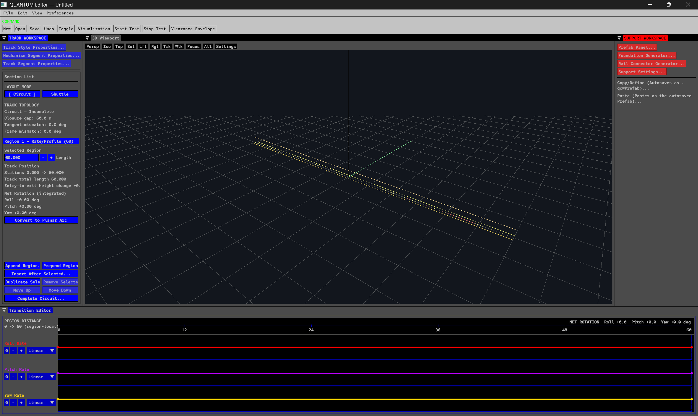
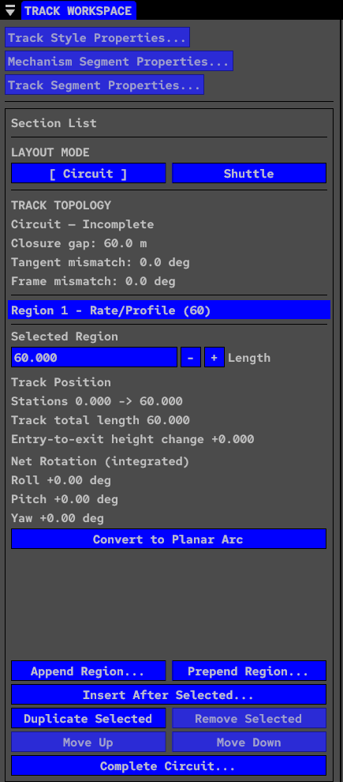
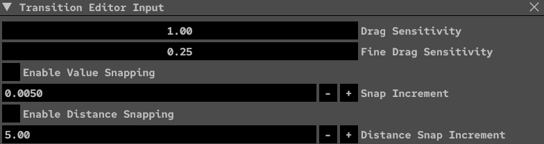
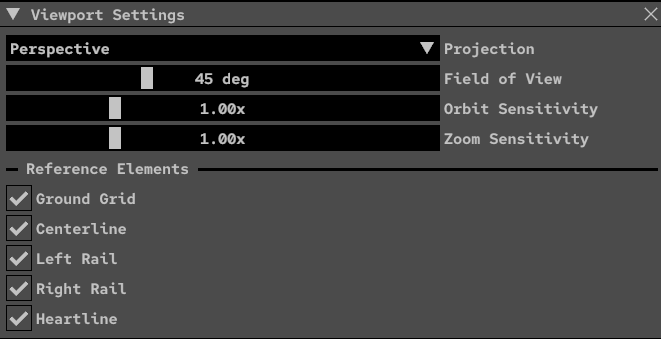

# QUANTUM

**An early-stage native roller-coaster software project built around authored geometry, rider-local track construction, and an interactive 3D editor.**



*Current QUANTUM development editor. The authored-track viewport, region authoring, topology foundation, and portions of the Transition Editor are functional. Many other visible controls represent experimental, incomplete, or planned systems.*

> [!IMPORTANT]
> ## QUANTUM is in active early development
>
> QUANTUM is **not a finished coaster simulator**.
>
> The editor currently contains a mixture of:
>
> - functional systems;
> - experimental systems;
> - prototype interfaces;
> - partially implemented workflows;
> - and placeholders for planned features.
>
> **A button, panel, menu item, or control appearing in a screenshot does not necessarily mean that the underlying feature is implemented yet.**
>
> Expect major changes to the UI, internal architecture, project format, simulation model, and workflow as development continues.

---

## Contents

- [What is QUANTUM?](#what-is-quantum)
- [Current Development Status](#current-development-status)
- [What Works Today?](#what-works-today)
- [What Does NOT Work Yet?](#what-does-not-work-yet)
- [Current Editor Interface](#current-editor-interface)
- [Track Visualization](#track-visualization)
- [Geometry Architecture](#geometry-architecture)
- [Circuit Completion](#circuit-completion)
- [Development Roadmap](#development-roadmap)
- [Technology](#technology)
- [Building QUANTUM](#building-quantum)
- [Running Tests](#running-tests)
- [AI-Assisted Development](#ai-assisted-development)
- [Disclaimer](#disclaimer)

---

# What is QUANTUM?

QUANTUM is an independent roller-coaster design and simulation software project written primarily in modern C++.

Its long-term goal is to provide a complete environment for:

- designing coaster layouts;
- authoring track geometry;
- editing transitions over distance;
- visualizing rider-local orientation and banking;
- simulating trains and ride systems;
- designing terrain-aware layouts;
- building coaster environments;
- and eventually presenting complete virtual rides.

QUANTUM is being developed as more than a conventional spline editor.

A major focus of the project is **coaster-oriented geometry authoring**: representing track through concepts such as distance, curvature, rider-local pitch/yaw/roll behavior, authored regions, transitions, topology, and eventually vehicle dynamics.

The project is currently transitioning from foundational mathematics and solver development toward increasingly interactive track authoring inside the native editor.

---

# Current Development Status

The current major milestone is:

## Interactive Track Authoring

QUANTUM can now represent and visualize complete connected authored tracks containing multiple region types.

Recent development has focused on making the editor behave increasingly like an actual coaster-design application rather than a collection of isolated geometry experiments.

Phases 1 and 2 now provide foundations including:

- complete connected multi-region `AuthoredTrack` visualization;
- deterministic distance-domain visualization;
- retained visualization caching and GPU buffers;
- viewport authored-region picking;
- complete selected-region highlighting;
- Section List ↔ viewport selection synchronization;
- Transition/Geometry Editor selection synchronization;
- region mutation and selection preservation;
- authoritative QuantumCore regeneration after authored geometry changes.

The next authoring work is tighter live Transition/Geometry Editor feedback, allowing parameter and profile changes to update the connected coaster interactively while the user edits.

Direct 3D manipulation, draggable track nodes, viewport deformation, and train simulation are not implemented.

---

# What Works Today?

The following represents functionality with an implemented foundation in the current development build.

## Editor

- Native Windows desktop application
- SDL3 application/window layer
- Vulkan renderer
- Dear ImGui editor interface
- Docked editor workspace
- Native 3D viewport
- Perspective camera
- Orthographic camera infrastructure
- Isometric / top / side-oriented viewport modes
- Ground/reference grid
- Viewport focus tools
- Section List
- Transition Editor
- Geometry Editor
- Project/document state infrastructure
- New / Open / Save / Save As document workflow

## Interactive Track Authoring

- Ordered authored-track regions
- Complete connected multi-region visualization
- Complete-track state and frame chaining
- Viewport authored-region selection
- Complete selected-region highlighting
- Section List ↔ viewport selection synchronization
- Transition/Geometry Editor synchronization
- Region append
- Region prepend
- Region insertion
- Region duplication
- Region reordering
- Region removal
- Region-length editing
- Selection preservation through mutations
- Authoritative Core regeneration after accepted geometry edits

## Authored Geometry

- Rate/Profile regions
- Planar Arc regions
- Straight / zero-rate geometry
- Rider-local pitch-rate integration
- Rider-local yaw-rate integration
- Rider-local roll-rate integration
- Coupled pitch/yaw/roll geometry
- Region-to-region frame propagation
- Continuous position and orientation tracking
- Distance-domain sampling
- Region boundary tracking

## Transition/Profile Editing

Current profile channels include:

- Roll Rate
- Pitch Rate
- Yaw Rate

The Transition Editor operates over the authored region's distance domain rather than treating the profile as an unrelated generic graph.

Several transition/profile function types are already represented internally and continue to evolve.

## Track Topology

- Circuit layout mode
- Shuttle layout mode
- Endpoint position-gap measurement
- Endpoint tangent mismatch
- Endpoint frame mismatch
- Closed-circuit verification
- Invalid/incomplete topology reporting
- Circuit Completion integration for incomplete Circuit layouts

## Experimental Circuit Completion Foundation

QUANTUM includes an experimental automatic Circuit Completion solver.

The solver can generate a connecting Rate/Profile region between the current track ending and beginning while attempting to satisfy:

- endpoint position;
- tangent orientation;
- frame orientation.

The production solver currently uses analytically propagated endpoint sensitivities for Jacobian construction.

Finite differences remain available internally as a validation/reference path.

## Mathematics / Core

- 3D B-splines
- NURBS
- Analytic first derivatives
- Analytic second derivatives
- Curvature helpers
- Radius helpers
- Adaptive arc-length integration
- Arc-length inversion
- Arc-length lookup tables
- Curve sampling
- Rotation-minimizing frames
- Deterministic geometry tests

## Documents

- Coaster document representation
- Authored-track document state
- Editor-side document state
- Serialization foundation
- Region editing workflow
- Track topology stored separately from rendering state

---

# What Does NOT Work Yet?

A significant amount of QUANTUM is still unfinished.

Examples of systems that are incomplete, experimental, placeholder-only, or not yet implemented include:

## Simulation

- Complete train simulation
- Vehicle dynamics
- Wheel/bogie simulation
- Gravity-driven train motion
- Kinetic/potential energy simulation
- Train mass modeling
- Multi-train operation
- Block-section logic
- Dispatch logic
- Station operation
- Lift hills and chain/cable lift behavior
- LSM/LIM launch systems
- Brakes and trim brakes
- Transfer and switch tracks
- Production ride testing

## Track Rendering

- Final rail/spine/cross-tie geometry
- Manufacturer-specific track styles
- Wooden coaster structures
- Final materials
- Production lighting

The current viewport uses an **engineering visualization** rather than a finished coaster-track mesh.

## Supports

Visible Support Workspace controls currently represent future work.

Systems such as the following should currently be treated as planned or incomplete:

- Prefab Panel
- Foundation Generator
- Rail Connector Generator
- Support Settings
- Automatic support generation
- Structural support analysis

## Environment

- Terrain authoring
- Terrain sculpting
- Terrain grading
- Roads
- Paths
- Foliage
- Scenery
- Buildings
- Water
- Environment lighting workflow
- Environmental effects

## Analysis

- Complete force-analysis workflow
- Ride-envelope and clearance workflows
- Restraint and evacuation analysis
- Structural engineering
- Certified safety analysis

## Distribution

- Production installer
- Stable binary releases
- Stable project compatibility guarantees
- Maintained Linux build
- Maintained macOS build

---

# Current Editor Interface

The interface itself is evolving alongside the underlying systems.

Some controls represent functionality already implemented. Others intentionally exist as prototypes, planned workflows, placeholders, or partially implemented controls.

For that reason, the current editor should be interpreted as a **development interface**, not a finished feature list.

---

## Track Workspace



The Track Workspace currently contains authored-track and topology controls.

Implemented foundations include:

- Circuit / Shuttle layout selection;
- track-topology information;
- authored-region selection;
- region length editing;
- append/prepend/insert operations;
- duplication;
- removal;
- reordering;
- Planar Arc / Rate Profile workflows;
- Circuit Completion integration.

Other surrounding Track Workspace controls may remain incomplete.

---

## Transition Editor



QUANTUM uses a **distance-domain transition workflow**.

Authored channels belong to a track region and describe behavior as distance progresses through that region.

Current channels include:

- Roll Rate
- Pitch Rate
- Yaw Rate

Input behavior already includes concepts such as:

- drag sensitivity;
- fine drag sensitivity;
- value snapping;
- distance snapping.

The Transition Editor remains under active development and should not yet be considered feature-complete.

---

## Viewport Settings



Current viewport configuration includes camera and engineering-reference controls.

Reference elements include:

- Ground Grid
- Centerline
- Left Rail
- Right Rail
- Heartline

These are currently visualization/reference curves rather than final rendered coaster rails.

---

# Track Visualization

QUANTUM currently renders an engineering representation of the authored track using four primary reference curves:

```text
Left Rail
Centerline
Right Rail
Heartline
```

The rail offsets follow the solved rider-local lateral axis.

The heartline follows the solved rider-local up axis.

This makes banking and frame orientation visible before final track meshes exist.

The visualization is generated from authoritative QuantumCore geometry.

The renderer does not independently reconstruct coaster geometry.

The current data path is conceptually:

```text
AuthoredTrack
      ↓
QuantumCore geometry integration
      ↓
Solved rider-local geometry samples
      ↓
Editor visualization representation
      ↓
Vulkan vertex buffer
      ↓
3D viewport
```

Visualization is retained and regenerated only when authored geometry changes.

Ordinary frames reuse the already-generated geometry and GPU buffers.

---

# Interactive Viewport Selection

Authored regions can be selected directly from the 3D viewport.

Viewport selection and editor selection share the same authoritative selection state.

Conceptually:

```text
Viewport click
      ↓
Selected authored region
      ↓
Section List
      ↓
Transition / Geometry Editor
      ↓
Viewport highlight
```

Selection from the Section List follows the same state in the opposite direction.

The complete selected authored region is highlighted rather than only the individual line segment clicked.

Selection does not regenerate coaster geometry.

Viewport selection does not provide draggable nodes, direct 3D manipulation, or viewport deformation.

---

# Geometry Architecture

QUANTUM does not treat the entire coaster as one generic editable spline.

Instead, layouts are assembled from **authored regions**.

Each region represents a portion of the track over a particular distance interval.

Regions are evaluated in sequence.

The ending position and orientation of one region becomes the starting state of the next.

Conceptually:

```text
Region 1
   ↓ final state
Region 2
   ↓ final state
Region 3
   ↓ final state
Region 4
   ↓
...
```

This makes the authored track an ordered geometric construction rather than an unrelated collection of local curves.

---

# Rider-Local Geometry

A central part of QUANTUM's geometry model is the rider-local frame.

At a position along the track, the system maintains an orientation basis including approximately:

```text
T = tangent / forward
L = lateral
U = up
```

Pitch, yaw, and roll behavior evolves this frame as distance progresses.

This allows coaster geometry to be described using concepts that are naturally related to the rider and track rather than only through world-space control points.

The geometry system supports coupled three-dimensional rotation.

Pitch, yaw, and roll are therefore not treated as three completely independent transformations.

---

# Rate/Profile Regions

Rate/Profile regions represent track using three primary authored profiles:

```text
Pitch Rate(s)
Yaw Rate(s)
Roll Rate(s)
```

where `s` represents distance through the region.

The profiles are integrated to construct the resulting three-dimensional track.

This makes it possible to author transitions explicitly over track distance.

A region can therefore describe behavior such as:

- changing curvature;
- changing elevation;
- changing heading;
- banking;
- unbanking;
- combined three-dimensional transitions.

---

# Planar Arc Regions

Planar Arc regions provide a more direct geometric representation for constant-curvature planar track.

Parameters currently include concepts such as:

- radius;
- sweep angle;
- plane tilt;
- bank change.

Planar Arc geometry participates in the same overall AuthoredTrack chain as Rate/Profile regions.

Supported planar arcs can also be converted into equivalent Rate/Profile representations.

Where conversion is supported, QUANTUM attempts to preserve the represented track geometry rather than merely preserving region length.

---

# Transition Authoring

QUANTUM's intended transition workflow is **timeline/distance-domain based**.

Rather than treating every profile as an isolated generic graph, channels are authored over a region's physical distance.

Conceptually:

```text
Region Distance
0 m -------------------------------------- L m

Roll Rate     ──────╮___________
Pitch Rate    ____╭─────────────
Yaw Rate      _________╭────────
```

The graphs describe how the track changes as the rider progresses through the region.

The current Transition Editor is still evolving toward this broader workflow.

---

# Circuit Completion

Circuit Completion is an experimental automatic-closure system. It attempts to add one Rate/Profile connector between the end and beginning of an incomplete Circuit layout.

The connector uses nine parameters, with piecewise-linear profiles between each channel's values:

| Channel | Parameters |
|---|---|
| Pitch rate | start, midpoint, end |
| Yaw rate | start, midpoint, end |
| Roll rate | start, midpoint, end |

The nonlinear solver targets endpoint position, tangent, and frame-orientation constraints while preserving the topology tolerances used to verify the completed track.

The production solver constructs its Jacobian from endpoint sensitivities propagated through the discrete geometry integration. Finite differences remain available internally for derivative validation. Deterministic reflected non-planar basin-access seeds help the search reach solution basins without relying on floating-point noise.

Convergence is not guaranteed for every layout.

A failure to converge does not necessarily prove that no valid connector exists.

The system deliberately reports failure rather than silently returning geometry that does not meet its closure requirements.

---

# Track Topology

QUANTUM explicitly models layout topology.

## Circuit

A Circuit layout is intended to return to its starting pose.

Closure can be evaluated using:

- positional gap;
- tangent mismatch;
- frame mismatch.

Circuit Completion may be used on an incomplete Circuit.

## Shuttle

A Shuttle layout is not expected to form a conventional continuous closed loop.

Circuit Completion is therefore not treated as required behavior for Shuttle layouts.

---

# Curve Mathematics

QUANTUM includes reusable mathematical infrastructure beyond the authored coaster system.

---

## B-Splines

Current B-spline functionality includes:

- 3D curve evaluation;
- analytic first derivatives;
- analytic second derivatives.

---

## NURBS

Current NURBS functionality includes:

- rational 3D curve evaluation;
- analytic first derivatives;
- analytic second derivatives.

---

## Arc Length

QUANTUM includes:

- adaptive numerical arc-length integration;
- arc-length inversion;
- reusable arc-length lookup tables;
- distance-domain curve sampling.

---

## Curve Geometry

Geometry utilities include concepts such as:

- tangent;
- curvature;
- radius;
- sampled geometric state.

---

## Rotation-Minimizing Frames

Rotation-minimizing frame infrastructure is available for geometric workflows where frame transport should minimize unnecessary twist.

---

# Document Model

QUANTUM separates numerical geometry, project data, editor state, visualization, and rendering.

A simplified architecture is:

```text
QuantumCore
     ↓
CoasterDocument
     ↓
AuthoredTrack
     ↓
Editor state
     ↓
Visualization data
     ↓
Vulkan renderer
```

QuantumCore does **not** depend on Vulkan or Dear ImGui.

This separation is deliberate.

QUANTUM is intended to evolve into a larger suite of coaster-related tools rather than forcing every subsystem into one inseparable executable.

---

# Rendering Architecture

QUANTUM currently uses a native Vulkan rendering backend.

Current rendering technology includes:

- Vulkan
- SDL3
- Vulkan Memory Allocator
- GLSL
- Dear ImGui
- GPU-backed engineering-track visualization
- retained vertex buffers
- viewport camera infrastructure

The current viewport is an engineering/editor viewport rather than a finished ride renderer.

---

# Planned Simulation Foundation

Track authoring comes before complete train simulation.

Future simulation work is expected to include systems such as:

```text
Authored Track
      ↓
Train Placement
      ↓
Vehicle / Bogie Sampling
      ↓
Mass + Gravity
      ↓
Velocity / Energy
      ↓
Forces
      ↓
Ride Systems
```

Potential systems include:

- train placement;
- vehicle progression;
- bogie positioning;
- wheel path sampling;
- train mass;
- gravity;
- velocity;
- acceleration;
- forces;
- drag/friction models;
- lifts;
- launches;
- brakes;
- block sections;
- dispatch logic.

These systems are **not yet complete production features**.

---

# Terrain and Environment

QUANTUM's long-term vision includes terrain-aware coaster design.

Future environment capabilities may include:

- imported terrain;
- terrain generation;
- grading;
- roads;
- paths;
- structures;
- foliage;
- scenery;
- water;
- lighting;
- environmental effects.

Detailed environment creation may eventually become a specialized part of the broader QUANTUM suite.

The main coaster editor should nevertheless remain terrain-aware enough for designing terrain-following rides.

---

# Long-Term Suite Direction

QUANTUM is intended to grow beyond a single monolithic program.

A possible future structure is:

```text
QUANTUM Editor
      │
      ├── Track authoring
      ├── Ride configuration
      └── Engineering workflow
              │
              ▼
QUANTUM Simulation
      │
      ├── Train simulation
      ├── Ride systems
      └── Presentation
              │
              ▼
QUANTUM Environment
      │
      ├── Terrain
      ├── Scenery
      └── World authoring
```

The exact product separation is still experimental and may change.

All applications should ultimately share compatible project/document infrastructure rather than becoming unrelated tools.

---

# Development Roadmap

A simplified current direction is:

```text
Geometry Foundation
        │
        ▼
Authored Track Foundation
        │
        ▼
Circuit Completion
        │
        ▼
Interactive Track Authoring   ← CURRENT
        │
        ▼
Simulation Foundation
        │
        ▼
Train / Track Visualization
        │
        ▼
Ride Systems
        │
        ▼
Terrain / Environment
        │
        ▼
Expanded Simulation Workflow
```

The roadmap is intentionally flexible.

Experiments may reveal that systems need to be reordered, redesigned, or split into smaller milestones.

---

# Technology

| Component | Technology |
|---|---|
| Primary language | C++23 |
| Build system | CMake |
| Dependency management | vcpkg |
| Window / input layer | SDL3 |
| Graphics API | Vulkan |
| GPU memory | Vulkan Memory Allocator |
| Editor UI | Dear ImGui |
| Mathematics | GLM |
| Serialization | nlohmann/json |
| Shaders | GLSL |
| Primary development platform | Windows |

---

# Supported Platform

QUANTUM is currently developed and tested primarily on:

**Windows 11 + MSVC**

Linux and macOS are long-term goals.

They are not currently maintained or tested to the same level as Windows.

---

# Building QUANTUM

## Tested Windows Development Environment

The current Windows development environment is tested with:

- Windows 11;
- Visual Studio 2026 / MSVC with C++ development tools, as selected by the checked-in preset;
- CMake 3.25 or newer;
- Git;
- Vulkan SDK, including `glslangValidator`;
- vcpkg.

Tool versions will evolve over time.

---

## 1. Clone the repository

```powershell
git clone https://github.com/Coasterpete/QUANTUM.git
cd QUANTUM
```

---

## 2. Install vcpkg

Example setup:

```powershell
New-Item -ItemType Directory -Force -Path C:\Dev\_tools | Out-Null
git clone https://github.com/microsoft/vcpkg.git C:\Dev\_tools\vcpkg
& C:\Dev\_tools\vcpkg\bootstrap-vcpkg.bat
```

Set `VCPKG_ROOT`:

```powershell
$env:VCPKG_ROOT = "C:\Dev\_tools\vcpkg"
```

To persist the variable for your Windows user:

```powershell
[Environment]::SetEnvironmentVariable(
    "VCPKG_ROOT",
    "C:\Dev\_tools\vcpkg",
    "User"
)
```

The session-level assignment is enough to continue immediately. Newly opened terminals will receive the persistent value.

---

## 3. Configure QUANTUM

From the repository root, configure the Debug preset:

```powershell
cmake --preset windows-msvc-debug
```

The project's `vcpkg.json` manifest will install required dependencies.

---

## 4. Build

```powershell
cmake --build --preset windows-msvc-debug
```

---

## 5. Run the Editor

```powershell
.\build\editor\Debug\QUANTUM.exe
```

---

## 6. Interactive Authoring Demo

Development builds currently contain an opt-in authored-track demo fixture.

From PowerShell:

```powershell
$env:QUANTUM_INTERACTIVE_AUTHORING_DEMO = "1"
.\build\editor\Debug\QUANTUM.exe
```

The demo is intended for development/testing and does not change the normal New-document contents.

To disable it in the current PowerShell session:

```powershell
Remove-Item Env:QUANTUM_INTERACTIVE_AUTHORING_DEMO
```

---

# Running Tests

Run the complete Debug suite with:

```powershell
ctest --test-dir build -C Debug --output-on-failure
```

QUANTUM contains intentionally expensive numerical regression tests.

In particular, Circuit Completion validation may take several minutes in Debug builds.

During normal development, focused test execution is recommended.

For example:

```powershell
ctest --test-dir build -C Debug -R "AuthoredTrack|QuantumEditor|Viewport" --output-on-failure
```

Run the complete suite at important checkpoints such as:

- major milestone completion;
- numerical-core changes;
- solver changes;
- pull requests;
- release verification.

Release tests are dramatically faster for some numerical workloads.

---

# Repository Layout

```text
QUANTUM/
│
├── core/
│   ├── include/
│   │   └── quantum/
│   └── src/
│
├── editor/
│   ├── assets/
│   ├── include/
│   └── src/
│
├── engine/
│   ├── include/
│   ├── shaders/
│   └── src/
│
├── tests/
│
├── docs/
│
├── CMakeLists.txt
├── CMakePresets.json
└── vcpkg.json
```

---

## `core`

Contains numerical and coaster-domain systems such as:

- curves;
- rider-local geometry;
- authored tracks;
- authored regions;
- topology;
- project/document structures;
- Circuit Completion.

---

## `editor`

Contains editor-facing systems such as:

- editor state;
- UI;
- track visualization;
- viewport picking;
- selection logic;
- transition tools;
- region summaries;
- camera controls.

---

## `engine`

Contains application/rendering systems such as:

- Vulkan context;
- GPU resources;
- application lifecycle;
- shaders;
- rendering integration.

---

## `tests`

Contains deterministic automated verification for:

- geometry;
- curves;
- arc length;
- frames;
- authored regions;
- profile editing;
- documents;
- viewport behavior;
- topology;
- Circuit Completion;
- numerical sensitivities;
- solver determinism;
- failure behavior.

---

## `docs`

Contains architecture notes and other development documentation.

---

# Testing Philosophy

QUANTUM intentionally has a relatively substantial numerical test suite for an early-stage independent project.

Coaster geometry can appear visually reasonable while still being mathematically incorrect.

Automated verification therefore covers behavior such as:

- analytic derivatives;
- curve geometry;
- arc length;
- frame orthogonality;
- rider-local integration;
- region chaining;
- deterministic authoring;
- topology;
- solver convergence;
- solver failure;
- sensitivity derivatives;
- viewport mapping;
- selection behavior;
- document state.

A new implementation is not considered correct merely because it is faster or looks reasonable in the viewport.

Numerical and topology behavior should remain explainable and reproducible.

---

# Development Principles

## Coaster-oriented authoring

Track-authoring concepts should make sense for coaster design.

Generic spline-control-point manipulation is useful, but it should not be the only available abstraction.

---

## Distance-domain workflows

Transitions should maintain an explicit relationship with physical distance along the track.

---

## Geometry before cosmetics

A beautiful mesh is not useful if:

- the centerline is wrong;
- the frame flips;
- banking is inconsistent;
- curvature is invalid;
- topology is broken.

Engineering geometry therefore comes before finished visual track models.

---

## Determinism

The same authored input should produce the same result.

Deterministic behavior is especially important for:

- geometry;
- solver results;
- project files;
- regression tests.

---

## Separation of concerns

Core coaster mathematics should not depend on:

- Dear ImGui;
- Vulkan;
- viewport UI;
- presentation logic.

Rendering should visualize authoritative geometry rather than duplicate it.

---

## Explicit failure

If a solver cannot satisfy its required constraints, QUANTUM should report failure.

It should not silently pretend that invalid geometry is acceptable.

---

## User-facing progress

Deep mathematical infrastructure matters, but the eventual purpose of QUANTUM is to become a usable interactive coaster-design and simulation application.

Development should therefore continue moving mathematical foundations into real editor workflows.

---

# AI-Assisted Development

QUANTUM is an independently directed project developed with substantial use of modern AI-assisted programming tools.

AI coding agents may be used for tasks including:

- implementation;
- boilerplate;
- refactoring;
- unit-test generation;
- numerical experiments;
- profiling;
- debugging assistance;
- documentation assistance.

The project remains **human-directed**.

Product direction, coaster-domain concepts, architecture requirements, UX goals, visual design, assets, acceptance criteria, testing decisions, and engineering review are determined by the project's author.

AI-generated code is **not considered correct merely because it compiles**.

Changes are expected to survive appropriate combinations of:

- code review;
- Debug builds;
- Release builds;
- automated tests;
- numerical verification;
- deterministic regression checks;
- manual editor testing;
- Vulkan validation.

The intent is to use AI as an engineering tool rather than as a replacement for engineering judgment.

---

# Contributions

QUANTUM is evolving quickly.

Before beginning a large contribution, consider discussing the proposed direction first.

This helps avoid duplicating systems that are already being redesigned or actively developed.

Contributions should generally avoid:

- duplicating coaster geometry mathematics in UI/rendering code;
- weakening tests simply to make a new implementation pass;
- silently changing numerical tolerances;
- introducing nondeterministic solver behavior without justification;
- mixing unrelated architectural changes into narrowly scoped work;
- presenting placeholder UI as completed functionality.

More formal contribution guidelines may be added as the project matures.

---

# Stability

QUANTUM does not currently promise stable internal APIs or project-file compatibility.

Breaking changes are expected.

That may include changes to:

- project/document schema;
- authored-region representation;
- UI layout;
- rendering architecture;
- simulation architecture;
- track parameterization;
- transition editing;
- internal APIs.

Projects created by early development builds may require migration or may become incompatible with later builds.

---

# Disclaimer

QUANTUM is a design and simulation software project.

It is **not** a certified:

- structural engineering tool;
- mechanical engineering tool;
- ride-safety analysis system;
- regulatory approval system;
- manufacturer engineering package.

Geometry, forces, clearances, train behavior, and other outputs should not be interpreted as professional engineering certification.

Real amusement rides require extensive engineering, analysis, testing, manufacturer review, and regulatory approval beyond the scope of this software.

QUANTUM is an independent project and is not affiliated with, endorsed by, or officially associated with any roller-coaster manufacturer or amusement park unless explicitly stated otherwise.

---

# Project Name

The public project name is:

# **QUANTUM**

The broader project may also be referred to during development as:

**Quantum CoasterWorks**

---

# The Road Ahead

The immediate priority is not adding every imaginable coaster feature.

QUANTUM first needs a strong authoring loop:

```text
AUTHOR
  ↓
VISUALIZE
  ↓
SELECT
  ↓
EDIT
  ↓
VALIDATE
  ↓
SIMULATE
```

The geometry foundation now exists.

The editor foundation now exists.

Interactive authoring has begun.

The next stages will continue turning those foundations into a usable coaster-design workflow before expanding into increasingly sophisticated train, ride-system, terrain, environment, and presentation capabilities.

For now:

## Build the track first.