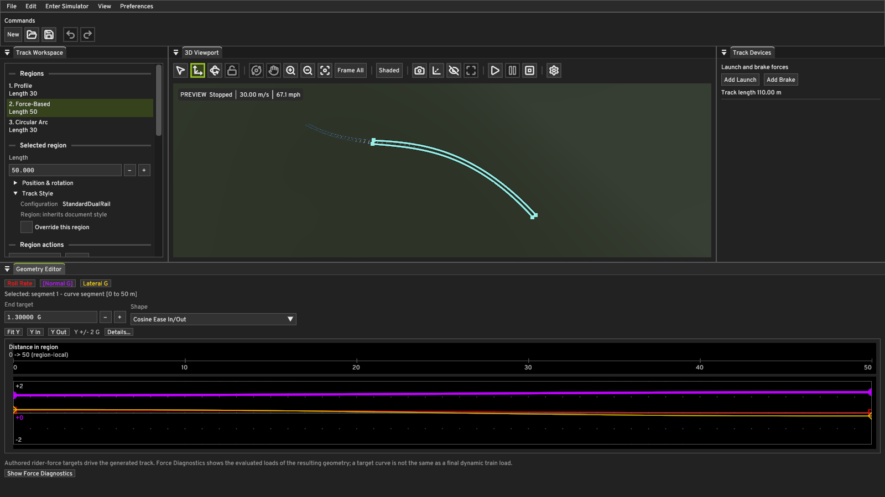
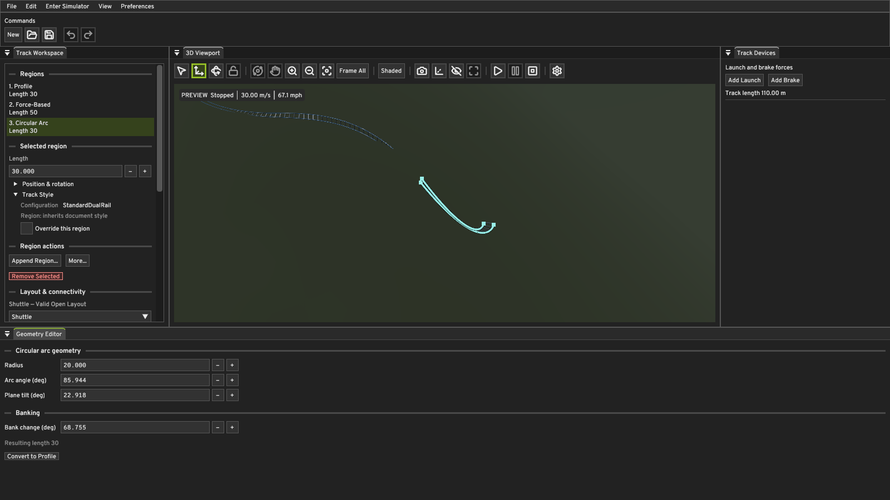
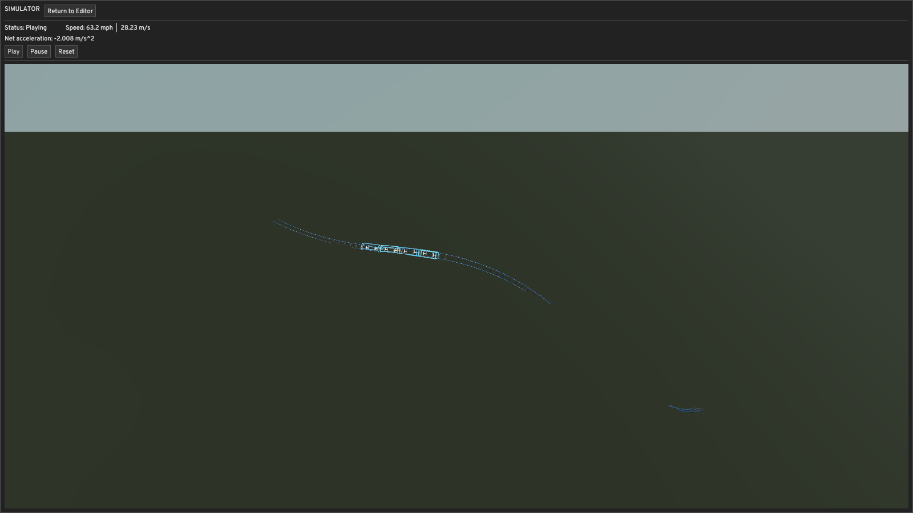
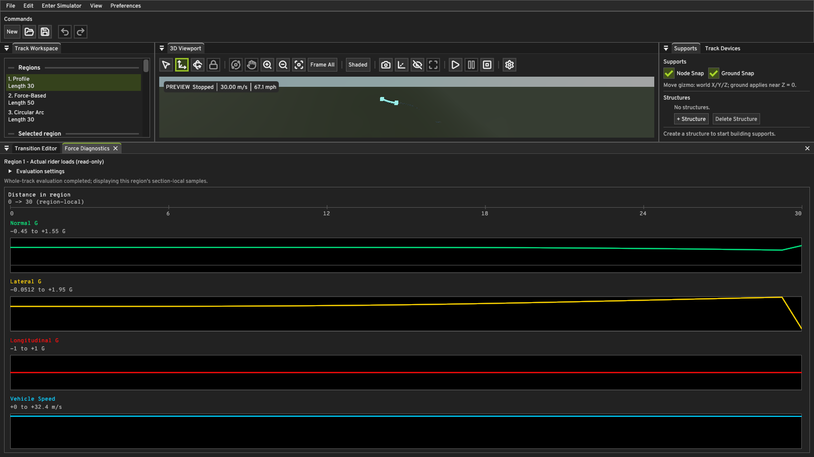
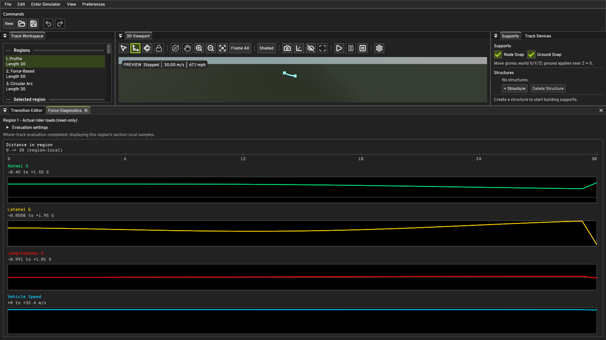

# Geometry Authoring M1 — Functional Heartline

## Scope

M1 promotes the persisted Coaster Setup heartline from a viewport-only guide
to an authored rider reference used by Core geometry and load calculations.
It deliberately keeps three different concepts separate:

1. **Construction reference `C(s)`** — the geometric track reference followed
   by rails, supports, bogies, `CompiledPhysicsTrack`, and multi-car train
   poses. The existing authored distance `s`, tangent, centerline curvature,
   gravity-energy calculation, and track-style offsets retain this meaning.
2. **Authored rider reference `H(s)`** — the configured heartline point
   `C(s) + h U(s)`, where `h` is the enabled Coaster Setup offset converted
   from metres to document coordinate units and `U` is local rider up.
3. **Actual train rider/load positions** — points transformed by each solved
   `CarPose`, such as the current repeated car loadout center. They are not
   snapped to the authored heartline.

`h = 0` (or a disabled heartline) takes the exact legacy construction-reference
path through the solver and rider-load evaluator.

## Coordinate and frame convention

QUANTUM's right-handed rider frame is `(T,L,U)` with `T × L = U`. Local frame
rates per construction-reference coordinate unit are `(r,p,y)`:

```text
T' =  y L - p U
L' = -y T + r U
U' =  p T - r L
```

For constant offset `h`:

```text
H    = C + h U
H'   = (1 + h p) T - h r L
H''  = h(p' + r y) T
     + ((1 + h p)y - h r') L
     - ((1 + h p)p + h r²) U
```

This is why an offset is functional during a roll even when `C` is straight:
the rider reference moves laterally and receives the expected centripetal
acceleration about the construction-reference roll axis.

`TrackKinematicState` therefore retains the construction position/curvature,
the local frame rates, and the roll/pitch rate derivatives needed for `H''`.
Profile regions obtain derivatives from the analytic transition functions.
Circular Arc regions transform the fixed-plane pitch/yaw into the banked rider
frame and retain the authored constant bank rate. Force-Based regions publish
the rates produced by their solve.

## Rider loads and Force-Based geometry

Construction energy remains unchanged:

```text
v² = initialSpeed² + 2 dot(g, mu (C - C_start))
```

Here `mu` is metres per coordinate unit. The construction-station acceleration
is `dot(g,T)`. The rider-reference acceleration is evaluated as:

```text
a_H = dot(g,T) H' + (v² / mu) H''
specificForce = a_H - g
```

Normal, lateral, and longitudinal G are projections of `specificForce` onto
`U`, `L`, and `T`. The diagnostic speed is the actual instantaneous rider-point
speed `v |H'`; reachability still uses construction-reference energy.

Force-Based Normal/Lateral targets now apply at `H`. At each integration stage
Core solves the offset-aware pitch and yaw rates while continuing to integrate
`C' = T`. With `p0` equal to the legacy zero-offset pitch expression:

```text
h p² + p + h r² = p0
```

Core selects the numerically stable root continuous at `h = 0`. Lateral target
solving includes `(1+h p)`, authored roll-rate derivative `r'`, and the lateral
component caused by construction-station acceleration. A geometrically singular
offset/target combination is rejected as a generation failure rather than
clamped.

Profile and Circular Arc construction geometry remains unchanged by `h`; their
rider-reference position and loads change. Force-Based construction geometry
can change because its targets are now enforced at the offset rider reference.
All three region kinds share the same `C+hU` convention and one boundary state,
so mixed-region position and frame continuity is retained.

## Which calculations are heartline-aware

Heartline-aware in M1:

* Force-Driven region pitch/yaw/pitch-rate solve (`ForceDrivenRegion.cpp`),
  and therefore the generated construction geometry of those regions.
* The universal rider-load evaluator (`RiderLoads.cpp`): rider reference
  position, `H'`, `H''`, specific force, all three G components, and the
  reported rider-point speed.
* The Editor Force Diagnostics panel, which reads those evaluated loads
  (`RiderLoadDiagnostics.cpp`).
* The viewport heartline reference curve, generated from the same `C+hU`
  definition (`CenterlineVisualization.cpp`).

Deliberately still on the construction reference `C` in M1:

* Gravity energy, speed, and reachability.
* Track-style rail, spine, and crosstie offsets, and all rendered track
  hardware.
* Support structures and their attachments.
* `CompiledPhysicsTrack`, the CPU/GPU train solvers, rigid-bogie articulation,
  and dynamic wheel/rail contact.
* Multi-car `CarPose` transforms and the repeated car loadout, which is where
  actual rider/load positions live.
* Track devices (launch, brake) and their station-based effects.
* Region lengths, arc-length tables, and editor framing.

The authored heartline is therefore an engineering rider-reference path and a
point-load diagnostic location, not a claim that every passenger occupies one
shared line. Per-seat rider bodies, seat-specific offsets, and feeding these
offset point accelerations back into the distributed rigid-train dynamics are
future work.

## Editor, persistence, and history

Coaster Setup labels the control **Authored rider reference** and explains which
systems use `C` versus `H`. The existing `coasterSetup.heartline.enabled` and
`offsetMeters` fields remain the persistence contract, so no format migration is
required, and `CreateNewDocument` keeps its 1.4 m default. Heartline edits now
use the full candidate-generation gate: canonical geometry, rider loads,
supports, renderer uploads, document publication, and history recording succeed
together. A candidate that cannot be generated — including an offset that makes
a force-driven target geometrically singular — is rejected with the real
`TrackGenerationFailure` reason and location, and the last valid committed
document is kept. Undo/Redo and save/load operate on the complete
`AuthoredTrack` value and regenerate through the same path.

## Focused verification

`QuantumCore.FunctionalHeartline` covers:

* exact zero-offset compatibility, against a disabled-heartline document;
* a straight roll and its offset centripetal load;
* a banked Circular Arc;
* Force-Based target enforcement at nonzero offset, plus proof that the offset
  changes the generated construction geometry;
* rejection of a singular offset/target combination as a generation failure,
  with the same document generating normally at zero offset;
* connected Profile, Circular Arc, and Force-Based regions;
* an inverted frame and the signed local-`+U` convention.

The existing serializer, Coaster Setup, document history, force authoring,
train physics, and Simulation Preview suites remain part of the full Debug and
Release test runs.

### Legacy fixtures pinned to the construction reference

`createNewDocument` defaults to an enabled 1.4 m heartline, so M1 legitimately
changes the default result of the force-region fixtures. `ForceDrivenRegionTests`
and `ForceDrivenAuthoringTests` set `heartline.offsetMeters = 0.0` in their
fixtures. Those suites assert exact rates, positions, and G values, so pinning
the fixture to the construction reference keeps them testing the force solve
they were written to test. No tolerance was loosened and no expected value was
rewritten to accommodate the new implementation. Nonzero-offset behaviour is
covered separately in `QuantumCore.FunctionalHeartline`.

## Windows Editor and Simulator validation

The checked-in mixed-region smoke document uses a 1.4 m heartline, a rolling
Profile region, a Force-Based region with changing Normal/Lateral G and roll
rate, and a tilted Circular Arc with a 68.8-degree bank transition.








### The heartline changes loads, not just a drawn line

`smoke-tests/geometry-functional-heartline-zero.quantum` is byte-identical to the
checked-in document except `heartline.offsetMeters` is `0.0` instead of `1.4`.
Both were captured through `--capture-screenshots` with the same region selected
(region 1, the rolling Profile region) and the same camera. The rendered track
geometry is identical by design, because `h` does not move Profile or Circular
Arc construction geometry. The evaluated rider loads are not:

Heartline offset 0.0 m — Longitudinal G is exactly zero across the region, which
is the correct construction-reference result for a gravity-only point mass:



Heartline offset 1.4 m — the same rails, but reshaped Normal and Lateral G, and a
nonzero Longitudinal G produced purely by coupled frame rotation at `H`:



Offset also drives generated geometry. The same document at a 10 m offset
regenerates completely different Force-Driven construction bounds, from
`[(0, 0, -4.91), (99.54, 14.44, 5.79)]` to
`[(0, -28.05, -13.67), (84.95, 9.77, 2.82)]`.

### Smoke and Vulkan validation results

Both were run from the real Windows executable with `--enable-gpu-validation`.
No Vulkan validation messages were emitted in either log.

| Run | Result | Detail |
| --- | --- | --- |
| Editor workspace, stopped preview, 3 s | PASSED | 300 frames, 0 fixed steps, 0 solver fallbacks |
| Simulator workspace, active playback, 2 s | PASSED | 483 fixed physics steps in 2.009 s, `fallbacks=0`, 0 open-boundary pose failures, ~100 FPS average |
| Simulator workspace, active playback, 4 s | FAILED | "playback stopped before the requested duration elapsed" |

The 4 s failure is the 110 m Shuttle fixture, not the heartline: the four-car
train reaches the open track boundary in about 3.3 s and playback ends. A 10 m
offset on the same document also generates successfully, so that particular
document is not the singular case; the singular combination is covered by the
Core test instead.

## What remains unverified

Stated plainly, so the evidence above is not read as more than it is:

* **No interactive heartline edit was demonstrated.** The accept and reject
  paths are covered by code review plus the Core-level generation-failure test.
  Driving the Coaster Setup widget through Win32 input automation was attempted
  and abandoned rather than reported as evidence.
* **The in-editor rejection was never observed at runtime.** The added
  `TrackGenerationError` handler is a catch clause; the Core throw it handles is
  proven by test, but no application run exercised the handler.
* **Undo/Redo across a heartline change and file save/load of the smoke
  documents were not exercised interactively**; both go through code paths that
  already regenerate through `createCenterlineVisualization`.
