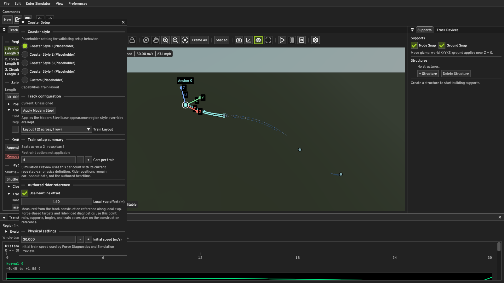

# Geometry Authoring M1 — Functional Heartline

## Scope

M1 promotes the persisted Coaster Setup heartline from a viewport-only guide
to an authored rider reference used by Core geometry and load calculations.
It deliberately keeps three different concepts separate:

1. **Construction reference `C(s)`** — the geometric track reference followed
   by rails, supports, bogies, `CompiledPhysicsTrack`, and multi-car train
   poses. The existing authored distance `s`, tangent, centerline curvature,
   gravity-energy calculation, and track-style offsets retain this meaning.
2. **Authored rider reference `H(s)`** — the configured heartline point
   `C(s) + h U(s)`, where `h` is the enabled Coaster Setup offset converted
   from metres to document coordinate units and `U` is local rider up.
3. **Actual train rider/load positions** — points transformed by each solved
   `CarPose`, such as the current repeated car loadout center. They are not
   snapped to the authored heartline. The Simulator now uses the authored
   `carsPerTrain`, but seat-by-seat rider bodies remain outside this milestone.

`h = 0` (or a disabled heartline) takes the exact legacy construction-reference
path through the solver and rider-load evaluator.

## Coordinate and frame convention

QUANTUM's right-handed rider frame is `(T,L,U)` with `T × L = U`. Local frame
rates per construction-reference coordinate unit are `(r,p,y)`:

```text
T' =  y L - p U
L' = -y T + r U
U' =  p T - r L
```

For constant offset `h`:

```text
H    = C + h U
H'   = (1 + h p) T - h r L
H''  = h(p' + r y) T
     + ((1 + h p)y - h r') L
     - ((1 + h p)p + h r²) U
```

This is why an offset is functional during a roll even when `C` is straight:
the rider reference moves laterally and receives the expected centripetal
acceleration about the construction-reference roll axis.

`TrackKinematicState` therefore retains the construction position/curvature,
the local frame rates, and the roll/pitch rate derivatives needed for `H''`.
Profile regions obtain derivatives from the analytic transition functions.
Circular Arc regions transform the fixed-plane pitch/yaw into the banked rider
frame and retain the authored constant bank rate. Force-Based regions publish
the rates produced by their solve.

## Rider loads and Force-Based geometry

Construction energy remains unchanged:

```text
v² = initialSpeed² + 2 dot(g, mu (C - C_start))
```

Here `mu` is metres per coordinate unit. The construction-station acceleration
is `dot(g,T)`. The rider-reference acceleration is evaluated as:

```text
a_H = dot(g,T) H' + (v² / mu) H''
specificForce = a_H - g
```

Normal, lateral, and longitudinal G are projections of `specificForce` onto
`U`, `L`, and `T`. The diagnostic speed is the actual instantaneous rider-point
speed `v |H'|`; reachability still uses construction-reference energy.

Force-Based Normal/Lateral targets now apply at `H`. At each integration stage
Core solves the offset-aware pitch and yaw rates while continuing to integrate
`C' = T`. With `p0` equal to the legacy zero-offset pitch expression:

```text
h p² + p + h r² = p0
```

Core selects the numerically stable root continuous at `h = 0`. Lateral target
solving includes `(1+h p)`, authored roll-rate derivative `r'`, and the lateral
component caused by construction-station acceleration. A geometrically singular
offset/target combination is rejected as a generation failure rather than
clamped.

Profile and Circular Arc construction geometry remains unchanged by `h`; their
rider-reference position and loads change. Force-Based construction geometry
can change because its targets are now enforced at the offset rider reference.
All three region kinds share the same `C+hU` convention and one boundary state,
so mixed-region position and frame continuity is retained.

## Editor, persistence, and history

Coaster Setup labels the control **Authored rider reference** and explains which
systems use `C` versus `H`. The existing `coasterSetup.heartline.enabled` and
`offsetMeters` fields remain the persistence contract, so no format migration is
required. Heartline edits now use the full candidate-generation gate: canonical
geometry, rider loads, supports, renderer uploads, document publication, and
history recording succeed together. Undo/Redo and save/load continue to operate
on the complete `AuthoredTrack` value.

The viewport heartline is generated from the same `C+hU` definition used by
Core diagnostics. Track-style rail/spine offsets continue to resolve from `C`.

## Dynamic physics boundary

The CPU/GPU train solvers and bogie constraints intentionally remain based on
the construction reference. M1 does not replace rigid-bogie articulation or
move vehicle contact geometry onto the heartline. Multi-car poses and rendering
are preserved, and the configured car count now reaches the preview consist.

The authored heartline is therefore an engineering rider-reference path and a
point-load diagnostic location, not a claim that every passenger occupies one
shared line. Per-seat rider bodies, seat-specific offsets, and feeding these
offset point accelerations back into the distributed rigid-train dynamics are
future work.

## Focused verification

`QuantumCore.FunctionalHeartline` covers:

- exact zero-offset compatibility;
- a straight roll and its offset centripetal load;
- a banked Circular Arc;
- Force-Based target enforcement at nonzero offset;
- connected Profile, Circular Arc, and Force-Based regions;
- an inverted frame and the signed local-`+U` convention.

The existing serializer, Coaster Setup, document history, force authoring,
train physics, and Simulation Preview suites remain part of the full Debug and
Release test runs.

## Windows Editor and Simulator validation

The checked-in mixed-region smoke document uses a 1.4 m heartline, a rolling
Profile region, a Force-Based region with changing Normal/Lateral G and roll
rate, and a tilted Circular Arc with a 68.8-degree bank transition.





The real Debug Windows executable completed both the stopped Editor smoke path
and active Simulator playback. The Simulator executed 480 fixed physics steps
in two seconds with GPU validation enabled, zero open-boundary pose failures,
and no solver fallbacks.
