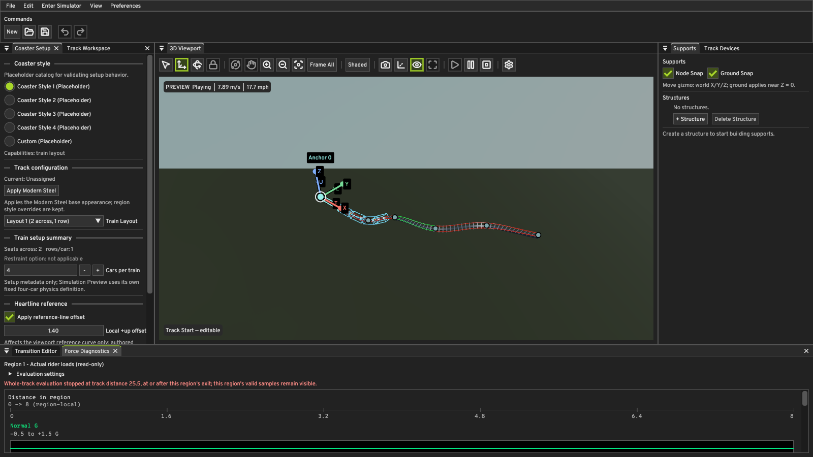
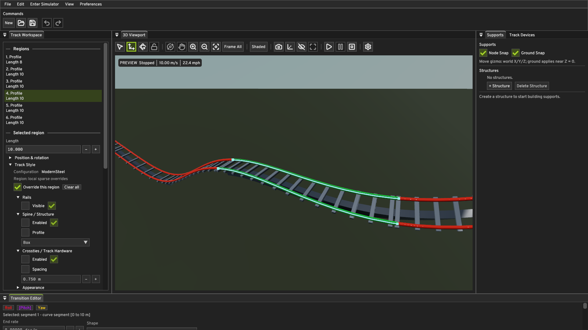

# Ground Surface M0.1 and Editor Workspace Polish

Follow-up to [Ground Surface M0](ground-surface-m0.md). M0 built the ground
surface and made the HDR environment selectable; it shipped with a first-run
Editor that showed the bundled **diagnostic** ground textures, a **Rooitou Park**
default sky, the reference grid on, floating tool windows, and a misleading
`PREVIEW Unavailable` overlay in the viewport.

This milestone changes the out-of-the-box presentation and fixes the workspace
layout. It adds no new rendering feature, no new asset format, and no new
subsystem.

## What changed

### DaySky is the new-session environment

`defaultEnvironmentAssetIdentifier` in `EnvironmentAssets.hpp` names the bundled
ambientCG DaySky panorama explicitly, instead of taking
`bundledEnvironmentAssets().front()`. The default is now independent of registry
order, so adding or rearranging a sky cannot silently change what a new session
looks like. The constant is applied in the four places that could otherwise
drift apart:

- `EditorUi::ViewportSettings::environmentAsset` (the user-visible default),
- `VulkanContext`'s initial IBL preparation,
- `EditorUi::setViewportEnvironmentEnabled` (the coarse preview-smoke toggle),
- the readme capture runner's environment default.

`QuantumEngine.EnvironmentAssets` asserts the identifier is bundled and pins the
literal, so a rename of the asset file fails a test rather than silently
reverting the default to whatever is first in the registry.

### Neutral ground instead of the diagnostic textures

`assets/ground/` still ships the three synthetic `test-ground-*.png` patterns
and they are still selectable — they are a regression fixture, not the default.
A fresh session leaves all three identifiers empty, so the built-in neutral 1x1
maps apply.

The renderer half of this was a real defect. `setGroundSurface` only did GPU
work when a texture *identity* changed, and the "no custom map" branch assumed
the neutral texel published at initialization was still bound. Once a user
selected a map and then pressed **Clear**, the custom map stayed bound while the
UI reported the slot as empty. Clearing a slot now actively republishes its own
neutral fallback through the same `replaceGroundTexture` path used for loading.

The same helper also fixed a second, pre-existing bug: the load-**failure**
branch used a hard-coded white `{255,255,255,255}` texel for *all three* slots.
For the normal slot that is wrong — white decodes to roughly
`(0.577, 0.577, 0.577)`, so a failed normal map left the ground tilted instead
of flat. Each slot now gets its documented fallback: white albedo, straight-up
`(128,128,255)` normal, white roughness.

### Reference grid off by default

`ViewportSettings::gridVisible` now defaults to `false`. The control is
unchanged (*Ground Grid* in Viewport Settings → Reference Elements); the grid is
a diagnostic, not part of the product-facing scene.

### ImGui docking and layout persistence

The dockspace is now built and submitted **before** any dockable window calls
`Begin()`. Previously the windows were drawn first, so a window could not join a
layout created later in the same frame and stayed floating until moved by hand.
Along with that:

- the four `ImGui::SetNextWindowPos(..., ImGuiCond_Appearing/FirstUseEver)`
  calls that fought docking and fought the persisted position were removed;
- the default layout was widened to cover the windows it was already meant to
  own — `Coaster Setup` joins `Track Workspace` on the left, `Viewport Settings`
  joins the right column, and the Geometry Editor, Performance Telemetry, and
  Transition Editor Input windows join the bottom row;
- `View → Reset Workspace Layout` rebuilds the default layout on demand. It also
  repairs a layout that was persisted in a bad state, because the builder docks
  windows that already exist immediately.

The build-time `captureLayout` flag on `buildDefaultDockLayout` is gone; the
default layout no longer differs between the Editor and a capture.

The persisted layout still wins. The default layout is only built when no
dockspace node exists yet, or when a reset was requested, so a user-arranged
workspace survives relaunch untouched.

### The PREVIEW overlay

`EditorUi` initialises `simulationAvailable_` to `false` and the Editor
workspace never publishes simulation status, so a fresh Editor used to render a
generic `PREVIEW Unavailable` badge implying something was broken. The generic
case now reads `PREVIEW Waiting for simulation status`, which is what it
actually means: no status has been published yet. A real failure still shows
the actual error text.

Separately, the readme capture runner now publishes real preview status the same
way `Application` does. Capture documents are valid, so a capture showing
`PREVIEW Unavailable` was misleading, and the committed M0 screenshots contain
exactly that.

## One defect found and fixed during verification

**The Coaster Setup window did not dock on a clean first launch.** It floated
over the viewport while every other window docked correctly.

`ImGui::DockBuilderDockWindow` applies immediately when the target window
already exists, and otherwise records the request in `ImGuiWindowSettings` for
`Begin()` to pick up. The dockspace is built before the windows exist, so
Coaster Setup took the deferred path — and that request did not take, leaving
the window floating. Because the default layout is not rebuilt once a dockspace
node is persisted, the floating state then stuck: it survived relaunch, and the
capture path (which closes Coaster Setup) never showed it, which is why it was
not visible in the committed M0 images.

The fix docks the window explicitly, once, into the node the Track Workspace
occupies. The request is only issued on a frame that actually reaches `Begin`,
so it cannot be consumed by a later window. This is the same one-shot pattern
the project already used for the Track Devices window.

Verified by deleting the layout ini and relaunching: every window now has a
`DockId`, with `COASTER SETUP` at the left node tab 0 and `TRACK WORKSPACE` at
tab 1.

## Verification

### Builds and tests

Full MSVC **Debug** and **Release** builds, clean. CTest: **81/81 passed in
each configuration** (`QuantumEngine.GpuTrainPoseResidency` is disabled in CMake
by design and did not run).

New assertions in this milestone:

- `QuantumEditor.ViewportPresentation` — `neutralSceneDefaults()`: a default
  `ViewportSettings` uses the DaySky environment, keeps the ground enabled with
  all three texture identifiers empty, and hides the grid.
- `QuantumEngine.EnvironmentAssets` — the explicit default is bundled, and it is
  still the DaySky asset.

### Real Windows application

Run against the real Debug and Release executables on an RTX 4070 with the
Khronos validation layer active (`CURRENT-VALIDATION-ENABLED` confirmed in the
logs). **Zero validation errors** in every run.

| Check | Result |
| --- | --- |
| Debug preview smoke | PASSED, `failure_message` empty |
| Release preview smoke | PASSED, `failure_message` empty |
| First launch, no layout ini | PASSED; all windows docked |
| User layout persistence | Custom layout survived relaunch unmodified |
| Editor → Simulator → Editor | PASSED, all 8 mode-cycle actions |
| Ground texture Clear | Clean under validation |

The mode cycle ran `enter Simulator and play` → `pause` → `resume` → `reset` →
`return to Editor` → `enter Simulator and play` → `pause` → `return to Editor`,
which is two full round trips, and the harness fails if it does not complete all
eight actions.

**Ground texture clearing** cannot be reached from the command line — the readme
capture harness builds a fresh `VulkanContext` per scenario, so no single process
goes from a bound map to a cleared one. It was verified the same way M0 verified
texture replacement: temporary instrumentation in
`createGroundSurfaceResources` drove the real path once per slot (bind all three
test maps, then clear all three back to the neutral fallback) during a Debug
validation run. The log confirms all three maps loaded and all three were
cleared, with no validation error, and the final state is identical to a normal
initialization. **The instrumentation was reverted and is not part of this
change.**

### Screenshots

| Default workspace, first launch | Neutral ground, default environment |
| --- | --- |
|  |  |

The first frame is a genuine first launch: no layout ini, Release build. It
shows the fully docked workspace, no reference grid, the DaySky sky, neutral
ground, and a live `PREVIEW` badge. Captured with:

```text
build/editor/Release/QUANTUM.exe --dev-preview-smoke \
  smoke-tests/modern-steel-validation.quantum \
  --capture-images <dir> --capture-workspace editor --duration 3
```

The second is the same ModernSteel document, region 3, deterministic camera, and
1600x900 as the committed M0 captures, with the environment left unspecified so
the **default** is what is being photographed. The manifest is committed next to
the image and re-runs with:

```text
cd docs
../build/editor/Release/QUANTUM.exe --capture-screenshots \
  ground-surface-m0-1/neutral-ground-capture.json
```

Compare against the M0 baseline for the same document and camera:
[`daysky/modern-steel.png`](ground-surface-m0/daysky/modern-steel.png) shows the
tiled diagnostic ground and an orange `PREVIEW Unavailable` badge. Both problems
are gone, and the sky above the horizon is unchanged.

## Remaining limits

These are unchanged from M0 and are **not** addressed here:

- Ground appearance and texture selections still reset when a document is
  reopened. Persisting them remains the scoped
  **Ground Surface M1 — persisted ground appearance** follow-up recorded in
  `ground-surface-m0.md`.
- The ground is still a flat, axis-aligned plane with no shadows, no metallic or
  AO map, PNG-only textures, and CPU-generated mips. See the "Remaining limits"
  section of `ground-surface-m0.md`.
- The bundled `test-ground-*.png` files are still synthetic diagnostics. They are
  no longer the default, but no production ground art has been supplied.
- `Reset Workspace Layout` discards the current arrangement. That is the intent
  of a reset, and it is not separately undoable.
