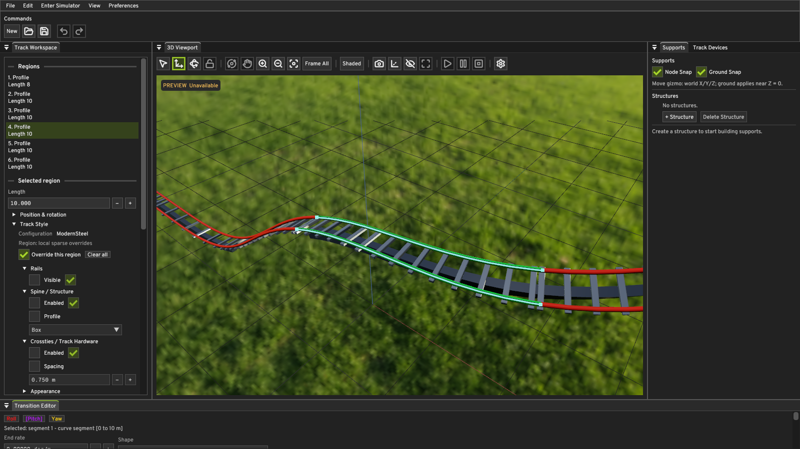
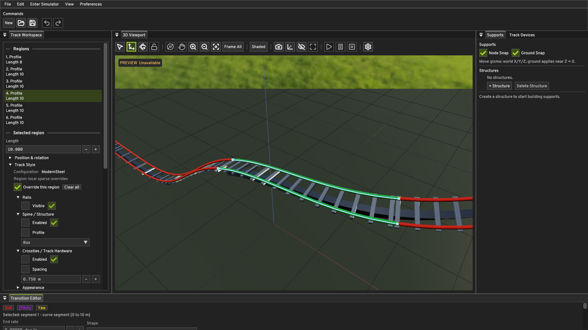
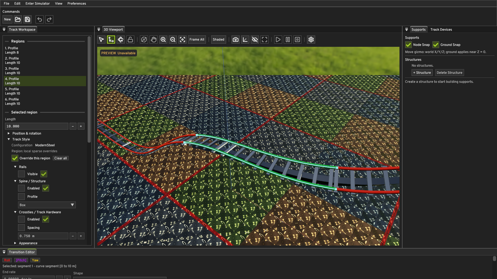
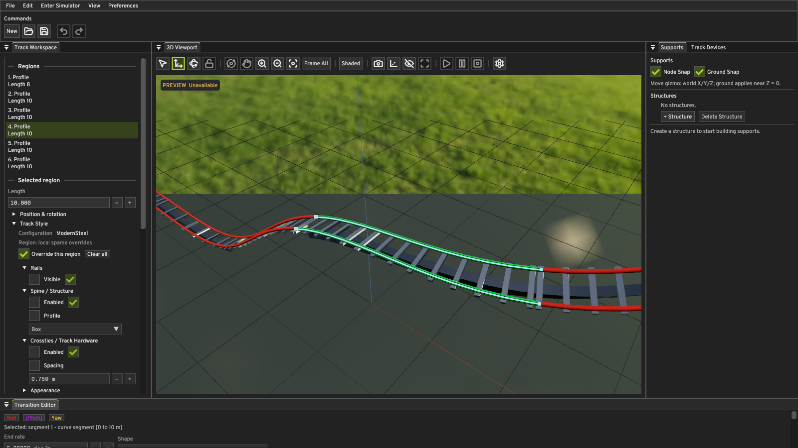
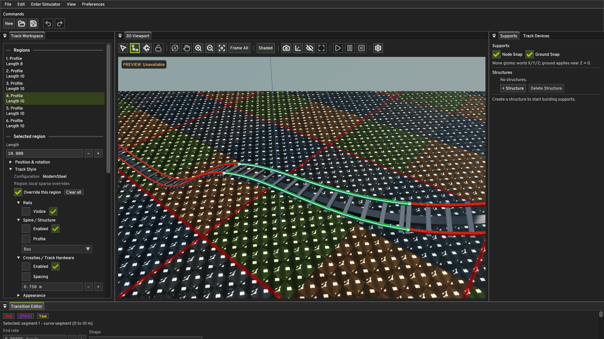

# Ground Surface M0

## Objective

Replace the HDRI's lower-ground impression with a real, rendered, configurable
ground plane. The HDR environment remains responsible for the sky,
image-based lighting, and reflections; the physical ground is a separate,
renderer-neutral scene element that is shaded by the same exposure and
tone-mapping pipeline as the track.

The milestone also makes the HDR environment a genuine **selectable** sky
rather than an on/off flag, and adds the developer-selected
[ambientCG DaySkyHDRI027B](https://ambientcg.com/view?id=DaySkyHDRI027B) as a
second bundled environment.

## Where the settings live

Ground Surface M0 settings are **viewport/scene settings**, not saved authored
document state. They live in `EditorUi::ViewportSettings::groundSurface`.

Rationale, and the decision the milestone was asked to make explicit:

- The ground is a scene presentation element with no relationship to coaster
  geometry, physics, or the authored track. Putting it in `AuthoredTrack`
  would drag Core serialization, validation, edit transactions, and Undo/Redo
  along with a scene-appearance control.
- The Editor owns the viewport settings and pushes them into the renderer
  every frame through `EditorUi::applyViewportSettings`. Both the Editor
  viewport and the Simulator call that same function, so the surface is
  consistent across workspace transitions by construction rather than by
  convention.
- The behavior is testable without a document: the settings are plain
  renderer-neutral values, and `QuantumEngine.GroundSurface` covers the
  validation, mesh, identifier, and texture-decode contracts.

**Persisting ground settings with the document is deferred.** Re-selecting the
textures after reopening a document is the current behavior.

## Renderer boundary

`quantum::renderer::GroundSurfaceSettings` is renderer-neutral and lives in
`engine/include/quantum/renderer/GroundSurface.hpp`. It is pushed with one
coarse `Renderer::setGroundSurface` call, consistent with the rest of the RHI:
one virtual call per coarse operation, none per vertex or draw.

`VulkanContext` owns the ground's GPU textures, descriptor set, sampler,
pipeline, and quad buffers. The CPU mesh generator
(`createGroundSurfaceMesh`) and the texture decoder stay renderer-neutral and
are unit tested without a GPU.

`setGroundSurface` is called every frame but only does GPU work when the quad
geometry (elevation, extent, tiling) or a texture identity actually changes.
Everything else — enablement, base color, metallic, roughness — travels
through push constants at draw time. This is what keeps the per-frame cost at
essentially zero and is why a slider drag does not stall the pipeline.

## Geometry

M0 is one flat, axis-aligned quad centered on the world XY origin: four
vertices, two triangles, normal `(0, 0, 1)`.

- UV tiling is **baked into the four corner UVs**, so the fragment stage needs
  no extra uniform and the ground's 128-byte push-constant block is identical
  to the track's. Resizing or re-tiling regenerates the four vertices in place.
- Triangles wind counter-clockwise seen from `+Z`, matching the track
  pipeline's front-face convention.
- The pipeline does not cull, so the surface is still correct when the camera
  drops below its elevation.

## Material and textures

The ground uses the same GGX PBR path as the track: the same `push_constant`
block layout, the same environment IBL branch, the same fitted ACES tone map,
and the same exposure multiply. `ground.frag` duplicates that PBR block rather
than sharing it, because the project's shader build compiles each stage
individually with `glslangValidator` and has no include step. A shared shader
chunk is a later cleanup, not part of this milestone.

Three texture slots, each with its own 1x1 built-in fallback so the fragment
shader needs no per-map availability flags:

| Slot | Fallback | Effect when set | Encoding |
| --- | --- | --- | --- |
| Albedo | white | multiplies the authored base color | uploaded `R8G8B8A8_SRGB`, decoded in hardware |
| Normal | straight up `(128,128,255)` | replaces the shading normal | `R8G8B8A8_UNORM` |
| Roughness | white | multiplies the authored scalar roughness | `R8G8B8A8_UNORM` |

Because the M0 surface is horizontal with UVs running along `+X`/`+Y`, its
tangent frame is the world frame (`T = +X, B = +Y, N = +Z`), so a tangent-space
normal map applies without any per-vertex tangent attribute.

Textures are **PNG only**, decoded through SDL 3.4's existing `SDL_LoadPNG`
(the same approved dependency the capture harness already uses to *write*
PNGs). No new dependency and no custom image decoder were introduced. Mip
chains are reduced on the CPU with a box filter; for sRGB-encoded sources the
reduction happens in linear light. Tiles repeat with a dedicated
`VK_SAMPLER_ADDRESS_MODE_REPEAT` + mip-linear sampler, because the HDR
environment's clamp-to-edge sampler is not reusable for a tiled surface.

Identifiers are package-relative and pinned to the ground package root, for
example `assets://ground/my-surface.png`. Anything else — an absolute path,
another package root, a `..` escape, or a non-PNG extension — is rejected
before the renderer touches a GPU resource.

### Test assets

`assets/ground/` ships three **synthetic diagnostic patterns, not art**, so the
import path, UV tiling, and per-map shading can be demonstrated and
regression-checked without shipping a real surface material. They are
generated by `tools/make_ground_test_textures.py` (standard library only) and
documented in `assets/ground/README.md`. They are clearly named
`test-ground-*.png` and the test asserts the generated content.

No personal ground texture was invented or substituted. Supply your own by
dropping a PNG into `assets/ground/` and selecting it in the Editor.

## HDR environment selection

Rendering M2 hard-coded one panorama and one descriptor set. M0 turns the
environment into a real choice without changing the decode path:

- `EnvironmentAssets.hpp` exposes a small renderer-neutral registry of bundled
  skies (identifier, display name, credit). Adding a sky is a data change:
  extend the list, stage the file, and the Editor combo picks it up. No HDR
  decode or shader change is needed.
- `VulkanContext` keeps one descriptor set and one sampler, and a cache of
  prepared image sets keyed by identifier. A selection that has not been
  prepared is preprocessed and uploaded once, then retained, so switching back
  to a previously used sky is free.
- `Renderer::setEnvironment` now takes an identifier instead of a boolean. The
  empty string is the "None" selection, which keeps the renderer's constant
  ambient term and draws no sky. An unknown identifier is rejected; a bundled
  sky whose file cannot be read is reported through
  `Renderer::environmentStatus()` and never silently replaced by a different
  sky.
- Rotation, lighting intensity, and sky visibility remain push constants, so
  they still never retire or recreate GPU images.
- The capability flag `hdrEnvironment` now answers "is the HDR/IBL pipeline
  available" rather than "did the selected file load", so a failed sky can
  still be changed.

The first environment is prepared during renderer initialization, which keeps
startup behavior identical to Rendering M2.

## The ambientCG asset, and what was NOT done

**ambientCG no longer publishes a Radiance `.hdr` for this asset.** The
`DaySkyHDRI027B_1K.zip` download contains only
`DaySkyHDRI027B_1K_HDR.exr`, `DaySkyHDRI027B_1K.usdc`, an 8-bit
`DaySkyHDRI027B_1K_TONEMAPPED.jpg`, a `.blend`, a `.tres`, and a `.png`
thumbnail. The old `..._1K-HDR.zip` naming now returns HTTP 404.

QUANTUM's pipeline decodes Radiance RGBE RLE only. Rather than add an EXR
decoder — PIZ/ZIP decompression, half-float conversion, and tiled layouts are
a substantial new subsystem that the task explicitly asked not to destabilize
this milestone — the panorama is **converted once, offline**, by
`tools/convert_ambientcg_hdri_to_radiance.py`, and the generated `.hdr` is
committed next to the existing bundled environment. The runtime loader is
untouched.

This is the same pattern the project already uses for its assets:
`tools/export_test_crosstie_glb.py` exports a Blender-authored GLB and the
result is committed, and the Poly Haven sky was likewise a pre-baked download.
The conversion script is a developer tool, not a build or runtime dependency;
nothing in `CMakeLists.txt` or `vcpkg.json` refers to it. It needs
`python -m pip install numpy OpenEXR` to re-run.

Two properties of that decision are worth stating plainly:

- **RGBE is lossy for extreme highlights.** The source sun peaks near 37000;
  RGBE keeps an 8-bit mantissa per channel with a shared exponent. This is the
  format the pipeline already consumes, and QUANTUM authors its own
  directional sun separately (`Renderer::setSunlight`), so the HDR sun disc is
  not the scene's key light. The Rendering M2 note that "the authored
  directional sun is independent of the sun photographed in the HDR image"
  still applies.
- **Row order is verified, not assumed.** The script refuses to convert unless
  the brightest texel is in the upper half of the image, which is the
  physically meaningful case for a sky panorama and therefore proves the first
  stored row is the zenith. For this asset the sun lands at 54.1 degrees
  elevation, matching Radiance's `-Y +X` convention where scanline 0 is
  `v = 0`. A future source that fails the check fails loudly instead of
  producing an upside-down sky.

The generated file is `assets/environment/dayskyhdri027b_1k.hdr`
(485,056 bytes, SHA-256
`99A8EBFF8834AA1AEDD68B5A8AB400F321A47FD57414416C4E571CB457281D49`).

**Deferred, documented separately:** a runtime EXR/USD/HDR-decoder
generalization. If a future sky source only ships OpenEXR, it currently needs
one offline conversion rather than working directly.

## Two confirmed Vulkan defects fixed during this work

Both were introduced by the ground-surface code and both are documented here
because they are the kind of defect that produces an `abort()`.

### 1. Descriptor-write batch built from dead stack storage

`createGroundSurfaceResources` declared its `VkDescriptorImageInfo` **inside**
the per-binding loop, stored `&imageInfo` into `writes[i].pImageInfo`, and then
called `vkUpdateDescriptorSets` with the whole array *inside* the same loop.
Entries 1 and 2 were therefore uninitialized garbage. The Vulkan validation
layer reported this on **every launch**:

```text
VUID-VkWriteDescriptorSet-sType-sType:          pDescriptorWrites[1].sType must be VK_STRUCTURE_TYPE_WRITE_DESCRIPTOR_SET
VUID-VkWriteDescriptorSet-descriptorCount-...:  pDescriptorWrites[1].descriptorCount must be greater than 0
UNASSIGNED-GeneralParameterError-RequiredHandle: pDescriptorWrites[1].dstSet is VK_NULL_HANDLE
```

A driver reading `pImageInfo` through a pointer to a destroyed stack frame is
undefined behavior and a plausible hard-crash source.

**Fix:** hoist the `VkDescriptorImageInfo` array beside the write array and
submit the batch once, mirroring the existing `EnvironmentVulkan.cpp` pattern.

### 2. Texture replacement overwrote live `VkImage`/`VkImageView` handles

`replaceGroundTexture` passed the **published** slot's resource straight into
`uploadGroundTextureImage`, which overwrote `destination.image` and
`destination.view` with the new handles. Consequences:

- the previous `VkImage` and `VkImageView` handles were overwritten and never
  destroyed — a permanent GPU-memory leak on every texture change;
- the upload failure path called `destroyGroundTextureImage(destination)`, so
  an early failure would have destroyed the **currently live** image.

This violated the renderer's own documented policy: "candidate allocation
happens first, publication replaces the active handle ... the displaced
allocation is reclaimed only after its owning frame-slot fence completes."

**Fix:** proper candidate-then-publish. Build the image in a local resource,
`waitForFrameCompletion()`, repoint the descriptor, and only then destroy the
displaced image and view. `uploadGroundTextureImage` now only ever releases
what it created. The HDR environment image cache and publication use the same
pattern.

### A third defect found while integrating the new sky

`findBundledEnvironmentAsset` returned `&asset` from a range-for over
`bundledEnvironmentAssets()`, which returns a vector **by value**. The pointer
dangled as soon as the temporary died, and the follow-on string copy read freed
memory. It surfaced as a `std::length_error("string too long")` and was caught
by `QuantumEngine.EnvironmentAssets`. **Fix:** a function-local static registry
so lookups hand out a stable pointer; the test now asserts pointer stability
across repeated lookups.

### The reported `abort()` dialog was never reproduced

This is stated plainly because it bounds what the fixes above can claim.

A report of a Microsoft Visual C++ Runtime `abort() has been called` dialog in
the Debug Editor, with `PREVIEW Unavailable` in the viewport, was investigated
first. The crash could **not** be reproduced:

- at `main` (`b9d3d2f`, ground work stashed) across the plain Editor, a
  `--mode-cycle --camera-orbit --resize-window` preview smoke, and the capture
  harness;
- with the ground-surface work present, across the same paths.

No pre-existing defect was found in the unavailable-preview path that the
screenshot state pointed at. Defects 1 and 2 above are the two that could be
*proven* with the real Debug executable and the validation layer, and defect 1
fired on every single launch. They are fixed and verified. But no call stack
from the reported session was available, so **this milestone cannot claim they
were its cause.** If the dialog recurs, the assertion text or a call stack is
needed to attribute it.

## Depth and Editor/Simulator consistency

The ground pipeline enables depth test **and** depth write with
`VK_COMPARE_OP_LESS_OR_EQUAL`, matching the track and reference-curve
pipelines, and it is drawn into the same offscreen depth attachment. Rails,
hardware, supports, and the editor grid therefore occlude the ground, and the
ground occludes the sky wherever it is in front of it. The ground is drawn
after the sky and before the track so track selection overlays still win.

The ground pipeline is rebuilt with the other viewport pipelines when the
sample count changes between 1x and 4x MSAA.

`EditorUi::applyViewportSettings` pushes the ground settings in both
workspaces, and both the Editor viewport and `drawSimulator` call it. Editor
and Simulator therefore share one surface, one material, and one camera
target.

## Editor controls

A compact **Ground Surface** section was added to the existing **Viewport
Settings** window, alongside *Outdoor Lighting* and *Reference Elements*,
using the same widget and tooltip conventions:

- **Show Ground** enable/disable
- **Ground Elevation** and **Ground Size** (one value keeps the plane square)
- **Ground Base Color** and **Ground Roughness**
- **Ground UV Tiling**
- one row per map (**Albedo**, **Normal**, **Roughness**) with *Choose PNG...*
  and *Clear*, the resolved package-relative identity, and the renderer's load
  state, with the failure reason on hover

The `Environment` combo is now built from the bundled-sky registry and offers
**None** plus each registered sky.

## Verification

### Builds and tests

The full MSVC Debug and Release builds passed. CTest passed all enabled tests
in each configuration.

New tests:

- `QuantumEngine.GroundSurface` — default settings, rejection of non-finite /
  out-of-range / malformed-identifier settings, identifier grammar and
  package-root pinning, package-relative path resolution, flat-quad geometry
  with upward winding, tiling baked into the corner UVs, resizing symmetry,
  mip-level counts, and decoding of the bundled test textures including their
  authored content.
- `QuantumEngine.EnvironmentAssets` — registry consistency and provenance,
  stable lookup pointers, every bundled sky decoding through the unchanged
  Radiance pipeline with the documented cubemap shapes, retained
  high-dynamic-range values, positive diffuse irradiance, the two skies
  decoding to genuinely different panoramas **and** different irradiance (so
  the selector is not cosmetic), and rejection of malformed panoramas.
- `QuantumEditor.ReadmeCapture` — the new `environment_asset` and `ground_*`
  manifest fields, their ranges, and their rejection of unknown fields,
  wrong types, out-of-range numbers, and invalid asset identifiers.

`QuantumEditor.ReadmeCaptureTests` now links `Quantum::Engine` because manifest
validation resolves ground and environment asset identities.

### Real Windows application

The Debug Windows application was launched with Vulkan validation active. The
plain Editor, the capture harness, the mode-cycle smoke, and the Simulator
smoke all ran with **no** validation error and no abort, in both Debug and
Release. A Release Simulator smoke completed 600 rendered frames and 1443 fixed
steps.

Ground texture **replacement** was verified under validation by temporarily
instrumenting initialization to replace an already-published texture twice
(including a slot swap between the sRGB albedo format and the UNORM normal
format), then reverting. It reported clean. The normal capture path also
replaces all three fallbacks with decoded textures on every run.

### Screenshots

All captures come from the real Windows Debug application through the existing
`--capture-screenshots` harness, using the same 1600x900 ModernSteel document,
region 3, and deterministic camera as the committed Rendering M2 captures.
Manifests are committed next to the images so they can be re-run.

| Environment only (ground off) | Built-in fallback ground |
| --- | --- |
|  |  |

The first frame is the pre-existing appearance: the HDRI's own lower
hemisphere fills the view, with only the editor reference grid over it. The
second has the ground enabled with the built-in fallback material. The HDRI
band above the horizon is unchanged between them, the ground occupies the
lower environment, and the track, hardware, and grid occlude it correctly.

| Custom textures | Resized and re-elevated |
| --- | --- |
|  |  |

The textured frame uses all three bundled test maps at a tighter tiling. The
tinted quadrants, red per-tile border, and checker detail are all visible, and
the normal map produces per-tile shading variation — custom maps demonstrably
drive the rendered surface, not just a selectable path in the UI. The resized
frame is a smaller plane at a negative elevation with a different roughness and
base color.

| Selected ambientCG DaySky HDRI |
| --- |
|  |

Same document, camera, and ground material, with the environment switched to
`assets://environment/dayskyhdri027b_1k.hdr`. The sky changes completely — a
pale blue day sky instead of the Rooitou Park field — which is the visible
proof that HDRI selection is real and that the ground is shaded by the selected
environment.

Simulator verification used the developer preview-smoke harness with
`--simulator --capture-images`, because the Simulator owns the
`SimulationPreview` and no screenshot harness existed for it. That is the one
harness addition in this milestone: `--capture-images <dir>` and
`--capture-workspace editor|simulator` opt into swapchain readback and PNG
output. The normal render path is unchanged unless they are passed.

## Follow-up milestone: Ground Surface M1 — persisted ground appearance

Recorded here as an explicit, scoped follow-up. It is **not** implemented by
this milestone.

**Goal.** Ground appearance and custom texture selections survive saving,
closing, and reopening a `.quantum` document, so a shared coaster file carries
its own ground material instead of resetting to defaults.

**Why it is not in M0.** Persisting the ground requires touching authored
document state, which M0 deliberately avoided: the ground is scene
presentation, and M0's scope was to establish the renderer-neutral surface and
its GPU lifetime rules. M0 documented and enforced the decision rather than
half-implementing a document format change.

**Scope.**

- One additive, optional `ground` object on the authored document root, at the
  existing format version, with unknown and malformed fields rejected rather
  than repaired — the same additive policy the document already uses for
  `physicalSettings`, `supports`, and the start pose.
- Persist the enabled flag, elevation, extent, base color, metallic, roughness,
  UV tiling, and the three package-relative texture identifiers. Nothing else:
  the ground stays renderer-neutral data, and no GPU handle, decoded image, or
  derived mesh is serialized.
- A document without the object loads with the M0 defaults, so documents
  authored before this milestone are unaffected.
- Missing or unreadable texture files must be reported, not silently dropped,
  and must not prevent the document from loading — the same
  report-and-fall-back policy `setEnvironment` and `setGroundSurface` already
  use at runtime.
- Follow the established edit path: the settings enter through
  `AuthoredTrackEditTransaction`, so they participate in the existing
  acceptance and publication invariant and in whole-document Undo/Redo, which
  already snapshots the complete authored track.
- Reset ground to defaults should be available the way track-style reset
  already is, so a document can return to the inherited look.

**Explicitly still out of scope at M1:** non-flat terrain, shadow reception,
metallic/ambient-occlusion maps, and any editor-side ground placement tools
such as a terrain or foundation-projection workflow.

## Remaining limits

- **No shadows.** The ground does not receive cast shadows, and nothing in this
  milestone renders them. No shadow map, shadow sampler, or shadow lookup
  exists. The documented lighting is the authored directional sun plus image-
  based lighting, exactly as for the track.
- **No metallic or ambient-occlusion map.** M0 has albedo, normal, and
  roughness slots. Metallic stays a scalar and there is no AO slot, so contact
  darkening under the track is not simulated.
- **PNG only.** Other texture formats (TGA, BMP, DDS, EXR) are rejected by the
  identifier grammar. A runtime EXR decoder is the separate deferred item
  described above.
- **CPU mip generation.** Mip chains are box-filtered on the CPU at load time
  rather than generated on the GPU. This is correct and deterministic but is
  not free for very large source images, which are capped at 16384x16384.
- **The ground is flat.** There is no displacement, no terrain, no slope, and
  no heightfield. A finite plane's silhouette against the sky is visible when
  the camera is far enough away that the plane's edge projects inside the
  view; increase **Ground Size** to push it out. The default 1200 units
  extends well past the viewport far plane for typical track framing.
- **Ground settings are not saved with the document.** They reset to defaults
  when the document is reopened. This is scoped and tracked as the
  **Ground Surface M1 — persisted ground appearance** follow-up milestone
  above.
- **The ground is horizontal and axis-aligned.** Elevation moves it along `Z`
  only; there is no rotation or offset control.
- **The PBR block is duplicated** between `track.frag` and `ground.frag`
  because the shader build has no include step.
- **Environment preprocessing is still one-time and CPU-side.** Preparing a
  sky costs a panorama decode plus cubemap, irradiance, prefilter, and BRDF
  passes; results are cached per identifier for the process lifetime, but
  there is no persistent disk cache, so the first launch of each sky pays the
  cost.
- **The bundled ground test textures are synthetic diagnostics**, not
  production art, and no personal ground texture was supplied or invented.
