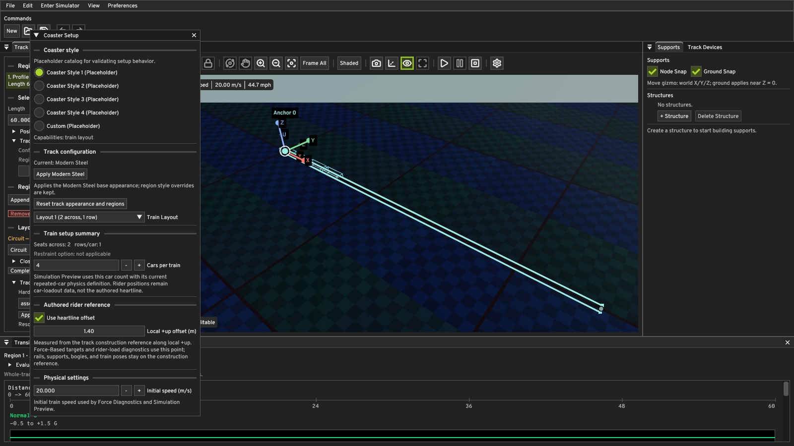

# Ground Surface M1 — persisted ground appearance

The authored document now owns ground appearance. The root `ground` object is
optional at format version 1. Documents without it load the M0 defaults.
When present, all fields are required: `enabled`, `elevation`, `sizeX`,
`sizeY`, `baseColor` (four components), `metallic`, `roughness`, `uvTiling`
(two components), `albedoTexture`, `normalTexture`, and `roughnessTexture`.
Unknown fields, wrong types, invalid ranges, and malformed identifiers reject
the document. Empty identifiers select the neutral map. Nonempty identifiers
must resolve below `assets://ground/` and name PNG files. Missing or unreadable
files retain their identifiers, report a load status, and use the renderer's
existing neutral fallback.

The Viewport Settings ground controls edit a transaction candidate and publish
the accepted document through `AuthoredTrackEditTransaction` and
`DocumentHistory`. Reset Ground to Defaults authors the M0 values. New, Open,
Undo, and Redo synchronize the controls from the active document. The renderer
continues to own texture decoding and GPU resources. HDRI selection is separate.

## Verification

- Windows MSVC Debug and Release editor builds succeeded.
- `QuantumEngine.GroundSurface`, `QuantumCore.CoasterDocument`,
  `QuantumEditor.DocumentHistory`, `QuantumEditor.DocumentState`, and
  `QuantumEditor.AuthoredTrackEditTransaction` passed in both Debug and Release
  (5/5 in each configuration).
- In the Windows Debug editor, selected a blue ground color and packaged
  diagnostic albedo, saved
  [`ground-surface-m1-persisted.quantum`](../smoke-tests/ground-surface-m1-persisted.quantum),
  created a new document (neutral ground), and reopened the saved document
  (blue textured ground restored). The document had no unsaved marker after
  reopening.
- A separate editor smoke run opened that saved document and loaded its albedo
  map. Another opened a document with
  `assets://ground/does-not-exist.png`, logged `Missing asset (built-in
  fallback)`, and exited successfully.

## Remaining limits

Ground Surface M0's flat surface, PNG-only texture support, and lack of cast
shadows remain. This milestone adds no terrain or material-map types.
