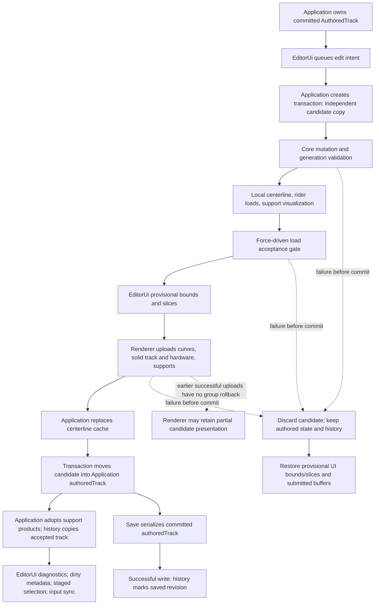

# Recovery M0: existing authored/editing state contracts

This note uses the completed Legacy Recovery Audit in the Codex chat
"Compare QUANTUM generations" (2026-10-03) as its starting point. Its scope is
the current C++ state model, documentation, and focused contract tests.
No production behavior, ownership, mathematics, file format, workspace, or
history policy changes are introduced.

## One ordinary Region edit

Follow a submitted Region length change in [Application.cpp](../engine/src/Application.cpp).
"Region" is the editor/domain vocabulary; the existing public APIs still use
`AuthoredTrackSection`, `SectionLengthEdit`, and `setSectionLength`.

1. **Committed owner.** `Application::runImpl` (called by the public `run`
   overloads) owns the local `authoredTrack` value.
   `EditorUi` holds selection and input buffers, not the canonical document.
   `DocumentHistory` retains independent accepted-document snapshots.
2. **Intent.** `EditorUi::beginFrame` puts the selected index and input value in
   `sectionLengthEdit_`. `EditorUi::takeSectionLengthEdit()` returns that intent
   and resets the optional so the application consumes it once.
3. **Candidate.** `AuthoredTrackEditTransaction{authoredTrack}` copy-constructs
   `candidateTrack_`. The application's `AuthoredTrack& candidateTrack` aliases
   that transaction-owned copy. It does not alias `authoredTrack`.
4. **Mutation.** `setSectionLength(candidateTrack.section(index), length)`
   validates a positive finite length and the existing section domain.
   Rate/force profiles rescale their distance domains; Planar Arcs preserve
   radius and sweep sign while adjusting sweep. A same-length request returns
   without changing Core content. Application still sets `candidateChanged`
   after this call; that flag is not a content-equality test.
5. **Derivation and validation.** `createCenterlineVisualization()` integrates
   the candidate and builds solved samples, semantic anchors, reference curves,
   section slices/bounds, resolved regional styles, solid mesh, and hardware
   batches. Core validates section domains and support anchors; the visualization
   rejects inadequate/non-finite samples and validates presentation inputs.
   `evaluateRiderLoadDiagnostics()` produces `RiderLoadHistory` from candidate
   inputs. Application also validates existing track devices against the new
   track length/layout before derivation. `createSupportVisualization()` uses
   candidate authored supports and candidate centerline samples. These are
   local provisional products.
6. **Acceptance gate.** `requireAcceptableRiderLoads()` rejects candidates
   containing force-driven Regions unless evaluation completed with states.
   Rate/Profile and Planar Arc-only documents keep the existing policy allowing
   incomplete/unreachable rider-load diagnostics. This is not a new universal
   requirement that every possible diagnostic must succeed.
7. **Presentation before authored commit.** Application provisionally calls
   `EditorUi::setCenterlineBounds/Sections`, then
   `Renderer::updateTrackCurveVertices`, `updateRenderableTrack`, and
   `publishSupportsToRenderer` (solid support products followed by member lines).
   The renderer owns its GPU resources. It receives generated products, not
   ownership of the candidate authored document.
8. **Commit and accepted products.** After those calls succeed,
   `centerlineCache.setTrackStyle/replace` adopts the candidate visualization;
   `editTransaction.commit(authoredTrack)` move-assigns authored state.
   Application adopts `candidateSupports`, supplies support visualization to
   the UI, calls `documentHistory.record(authoredTrack, continuousDrag)`, and
   supplies accepted rider loads to the UI. `synchronizeDirtyState()` copies the
   history's dirty result into `DocumentState` and updates the window title.
9. **Selection and buffers.** A length-only edit retains selection. Structural
   commands call `stageSelectionAfterCommit(index)` while editing the candidate.
   After the try/catch, `selectionAfterCommit()` returns that index only if
   `commit()` ran. Application then calls `EditorUi::selectSection(index, true)`.
   Submitted numeric buffers refresh from the final committed document on both
   success and rejection. Selection itself is not stored in history.

The application coordinates these steps. The transaction class owns the
candidate and staged effects; it does not upload, record history, or automatically
validate when `commit()` is called.

## Vocabulary and ownership

| Term | Definition | Existing representation and owner |
|---|---|---|
| Authored state | User-controlled canonical document data | Committed `AuthoredTrack` in `Application::runImpl`: ordered sections, start pose, physical/setup settings, styles, supports, devices, ground |
| Candidate state | Proposed editable data not yet accepted | `AuthoredTrackEditTransaction::candidateTrack_`, owned by the local transaction; some focused paths use a local copied `AuthoredTrack` directly |
| Derived state | Products calculated from authored/candidate data | `CenterlineVisualization`, `RenderableTrack`, `SupportVisualization`, `RiderLoadHistory`, simulation products; initially local, then retained by caches/models or application state |
| Presented state | Derived products currently supplied to editor/renderer presentation | `CenterlineVisualizationCache`, application `supportVisualization`, editor diagnostics/bounds/slices, renderer resources; there is no single presented-state object |
| Saved state | Revision/content corresponding to the last successful save | `DocumentHistory::savedRevision_` identifies a revision; `DocumentState` holds the path and mirrored dirty flag; serialized authored content is written to that path |

"Compiled" is a useful description of some derived products, not a distinct
current C++ document type. Authored support graphs belong to authored state;
their generated display lines/instances belong to derived state. Generated
samples are authoritative *outputs of a solve*, not editable document truth.

`EditorUi` borrows the committed track and centerline/support visualization
objects through pointers. Application declares these owners before `EditorUi`,
so they outlive its use. Replacing a value inside the existing cache/application
object preserves that object's address; pointers to its old elements must not
be treated as durable handles. Editor diagnostics own the accepted load data,
and renderer resources have their own Vulkan lifetime.

Saved state does not map perfectly to a retained object. C++ keeps no saved
canonical JSON baseline. `DocumentHistory::reset()` establishes a clean revision
for both New and Open, so a clean untitled document need not have been saved.
`DocumentState::hasPath()` describes path availability, including a loaded file;
dirty state describes revision identity, not the existence of a file on disk.

## History and saving

[DocumentHistory.cpp](../editor/src/DocumentHistory.cpp) implements bounded
whole-document value snapshots, with a default capacity of 128 states.
`record()` assumes its caller accepted the supplied state; it does not perform
validation or compare content. A new accepted branch erases redo. Continuous
records replace the gesture's latest state while retaining the pre-gesture
Undo state. Each recorded/replaced entry receives a new revision identity.

`markSaved()` ends continuous grouping and identifies the current revision as
clean. `isDirty()` compares the cursor entry's revision to `savedRevision_`.
Undo/Redo to that exact revision is clean. A separately accepted state with
identical serialized content remains dirty. If the saved entry is discarded by
branching or capacity trimming, the retained saved revision identity does not
provide a content-based way to become clean.

Application's `writeSerializedDocument` lambda serializes the committed
`authoredTrack`. `saveToCurrentPath` and `saveToChosenPath` call `markSaved()`
only after the write helper reports success; cancellation/failure returns first.
This note does not establish crash-safe or atomic disk saving.

Undo/Redo first moves the history cursor and returns a copied snapshot.
Application's `publishHistoryState` regenerates/uploads before replacing authored
state on the ordinary full-generation path. If that publication throws, the
handler moves the cursor back with the opposite history operation. Restored
selection is clamped/refreshed rather than recovered from a historical selection
snapshot. Device-only and presentation-only changes have narrower existing paths.

## Legacy ideas: comparison, not a port

Legacy references are `PreparedTrackGraphState`, `TrackAuthoringSession::Commit`,
`IsCandidateRevisionCurrentCore`, `IsDirtyCore`, and
`TrackAuthoringEvaluationCoordinator` under `Quantum.Application/Authoring`.
They retain exact compilation/canonical package content, check request/base
revisions, reject identical-content commits as changes, and support asynchronous
evaluation/cancellation. Those policies are not automatically C++ requirements.

| Legacy concept | Classification in current C++ | Evidence and implication |
|---|---|---|
| Prepared state | Partially present | Ordinary edits stage local authored/derived values; `PreparedDocument` and `prepareDocument()` bundle parsed/generated/accepted Open/startup data. No immutable prepared bundle or compiled history entries for every edit. |
| Freshness/revision checks | Absent but potentially useful | Transaction has no base revision; cache generations count rebuilds/presentation, not request freshness. Ordinary editing is synchronous within one application-loop iteration. Checks become relevant if evaluations can overlap later. |
| Content-identical no-op commits | Partially present | Core same-length/conversion operations and some UI/application comparisons avoid work. Neither `commit()` nor `record()` deduplicates content. Accepted identical records still create revisions and can discard redo. |
| Preview versus accepted state | Partially present | Candidates/products are provisional before commit. Live authored drag frames commit each successful frame and coalesce history; there is no general last-valid uncommitted preview session. `SimulationPreview` primarily consumes committed state. |
| Cancellation/stale-result handling | Partially present | Uncommitted candidates can be discarded; rejection restores relevant input buffers; structural edits suppress same-frame profile edits whose indices/construction would be stale. No asynchronous authoring request cancellation/revision protocol exists. |
| Canonical saved-content baseline | Absent but potentially useful | Current dirty tracking deliberately uses saved revision identity. Adopting Legacy content equality would be a separate history/dirty policy decision, outside M0. |

Legacy's graph/session class structure and asynchronous coordinator are not
appropriate to copy into this synchronous M0 workflow. No frontend-neutral
session, revision framework, workspace composition, or retained compiled history
is introduced here.

## Narrow contract findings

| Area | Finding | M0 action |
|---|---|---|
| Candidate/committed ownership | Value ownership already present; nested mutable-container isolation and discard needed direct coverage | Added `discardedCandidateOwnsIndependentRegionData` |
| Selection after commit | Rejection coverage existed; successful generation versus explicit commit needed direct coverage | Added `acceptedStructuralCandidateExposesSelectionAfterCommit`; this tests the helper gate, not live UI calls |
| Failed candidate and redo | Initial rejection tested; rejection after Undo did not directly protect redo/saved-revision access | Added `rejectedCandidateAfterUndoPreservesRedoAndSavedRevision` |
| No-op edits and dirty state | Different Core/application/history meanings were unclear; no universal no-op promise established | Documented behavior and added `contentIdenticalAcceptedEditStillCreatesRevision`; policy unchanged |
| History ownership | Retained/restored document copy independence needed explicit protection | Added `historySnapshotsAndRestoredValuesAreIndependent` |
| Save during continuous editing | `markSaved()` already ends grouping; saved entry preservation needed coverage | Added `saveEndsContinuousEditAndPreservesSavedUndoState` |
| Stale publication | Synchronous ordering and structural suppression already present; no general freshness guard | Documented limitation; no speculative asynchronous test/system |
| Derived publication failure | Authored commit is gated on uploads, but presentation updates are not atomic as a group | Documented source-supported rollback limit; no renderer changes or fake GPU rollback test |

No runtime behavioral defect was reproduced in M0. Missing coverage and unclear
documentation are distinguished from the following source-supported limitation:
`VulkanContext::updateTrackCurveVertices()` adopts its new buffer before later
track/support uploads run. A later exception can therefore leave earlier GPU
products updated although authored commit was not reached. Application's catch
restores provisional UI bounds/slices, not all earlier renderer resources.
The broad synchronization wording in `architecture.md` must be read with this
qualification; it is not evidence of complete GPU rollback.

The try block also contains work after commit, including history/UI updates.
`commit()` has no automatic inverse; the catch does not undo an already executed
commit. This is another reason to describe the actual ordered gate rather than
promise atomicity across every allocation and editor update. Fault injection or
live GPU failure testing would be needed to establish observed failure behavior.
No such failure was injected here.

## Actual ordinary-edit flow

The arrows describe synchronous order, not a single atomic state swap. The
presentation-only style path reuses solved samples and updates selected products
instead of performing the full derivation shown above.

## C++ concepts to understand now

`AuthoredTrack` contains values such as `std::vector`, `std::string`, structs,
and `std::variant`. Its implicit copy constructor copies these members, including
nested section/profile containers. The transaction owns that independent copy.
Changing a candidate's profile segment or section ordering does not change the
committed containers. The new discard test checks this with real Region data.

`const AuthoredTrack&` in the transaction constructor borrows the input for
copying without granting mutation through that reference. In contrast,
`AuthoredTrack& candidateTrack` grants access to the transaction's mutable value.
Neither reference owns the object it names; the application and transaction
must outlive their respective uses.

`std::move(candidateTrack_)` permits move assignment into `committedTrack`;
it does not itself validate or commit anything. Move assignment can transfer
owned vector/string storage instead of copying it. After acceptance, do not use
the moved-from candidate or previously obtained references as the editable
document. `committed_` makes staged selection available, and application applies
it against the new committed value.

Authored data describes user intent; derived data is recalculable output. Committed
means accepted into the current document; saved means the identified revision
was successfully written, with New/Open's clean-baseline convention noted above.
Renderer publication supplies visible products; it does not own authored truth.

Read these four small functions first:

1. `AuthoredTrackEditTransaction::commit()` in
   [AuthoredTrackEditTransaction.hpp](../editor/include/quantum/editor/AuthoredTrackEditTransaction.hpp).
2. `AuthoredTrackEditTransaction::selectionAfterCommit()` in that same header.
3. `DocumentHistory::markSaved()` in
   [DocumentHistory.cpp](../editor/src/DocumentHistory.cpp).
4. `DocumentHistory::isDirty()` in that same source file.

Container value semantics, references, move assignment, and revision versus
content identity matter now. Variant dispatch is useful background. Solver
internals and Vulkan synchronization details can wait for their own focused study.

## Verification

The changed files contain documentation and tests only. The two affected Debug
test targets and five related targets were built with the existing Windows MSVC
configuration. Both focused CTest suites passed, followed by all seven tests
selected by `ctest --test-dir build -C Debug --output-on-failure -L 'history|transaction'`:
ForceDrivenAcceptance, ForceDrivenAuthoring, AuthoredTrackEditTransaction,
AuthoredStartPose, SupportNodeManipulation, SupportAuthoring, and DocumentHistory.
`git diff --check` passed for the changed tracked files. The history build emitted
an existing `[[nodiscard]]` warning in support-member test setup, not in added code.

These tests do not invoke `Application::run`, native dialogs, a real renderer,
or live editor actions. Existing force-acceptance tests simulate the upload
boundary with a counter; they do not establish GPU-failure rollback. No fresh
capture, live interaction, disk-failure injection, or renderer-failure injection
was performed. No production runtime behavior changed. Recovery M1 is not started.
