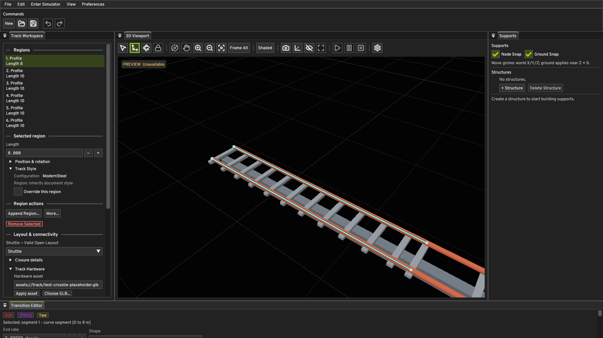
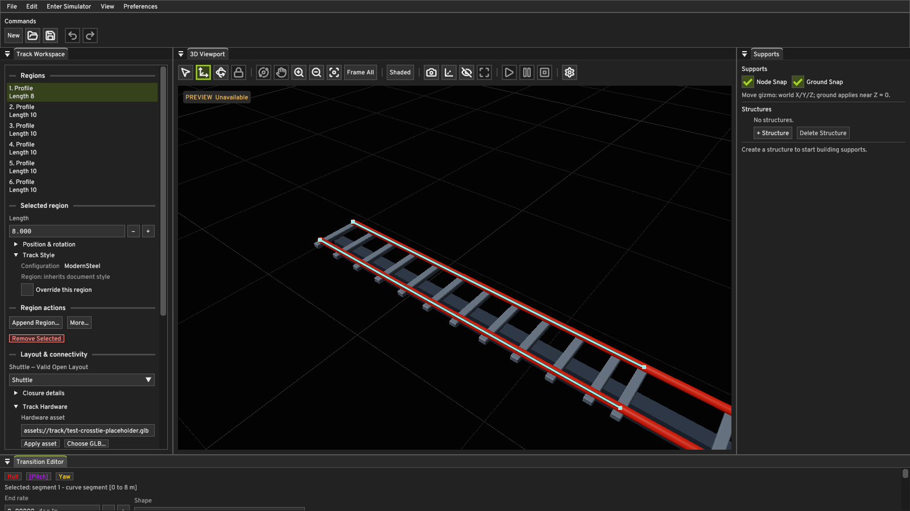

# Rendering M0: material and lighting foundation

## Renderer audit

| Capability | Before M0 | After M0 |
| --- | --- | --- |
| Pipelines | Dynamic-rendering viewport line, track triangle/edge, and instanced hardware triangle/edge pipelines | Same pipeline structure; shaded track and hardware share one PBR fragment shader |
| Materials | Track and hardware draw batches carried only base color; GLB primitive materials were dropped | Base color, metallic, and roughness per draw; GLB primitive factors retained unless an explicit track-style override applies |
| Lighting | One fixed Lambert directional light and constant ambient term | Configurable world-space sun direction and intensity, GGX specular, diffuse, and restrained sky fill |
| Geometry | Procedural rails/spines and cached, instanced static GLB hardware | Unchanged geometry and asset identity contract |
| Color | sRGB viewport attachment; lighting performed on encoded colors | sRGB base color decoded before linear-light shading; exposure and ACES fitted tone map written to the sRGB attachment |
| Depth and targets | D32 depth, R8G8B8A8 sRGB viewport, sampled by ImGui | Unchanged |
| Anti-aliasing | Single-sample viewport and pipelines | Unchanged; MSAA or temporal AA remains a follow-up |
| Resource lifetime | VMA buffers, deferred retirement, one in-flight frame, fences and barriers | Unchanged; material and lighting settings are copied into command-buffer push constants |
| Timing | CPU frame diagnostics and GPU timestamp query | Unchanged; used for M0 measurements |

Track style colors are authored as sRGB values. glTF `baseColorFactor` is linear, so the loader converts its RGB components to the same sRGB storage convention before the shared shader decodes them. Metal and roughness factors remain linear. Old `.quantum` documents omit the new factors and load with the compatible painted-surface defaults (metallic 0, roughness 0.42). The editor presents roughness directly rather than a second glossiness parameter.

The direct light uses a normalized sun vector from the surface toward the sun. The BRDF uses a 0.04 dielectric reflectance, Schlick Fresnel, GGX normal distribution, and Smith geometry term. A small constant sky fill keeps shadow-side geometry visible while environment lighting is absent. Sun azimuth, elevation, intensity, and exposure are in Viewport Settings. The first ModernSteel rail uses roughness 0.24; its metal spine uses metallic 0.8 and roughness 0.58. The painted crosstie override remains dielectric.

The GLB loader still supports its existing single-mesh, untransformed, triangle-and-normal contract. It now reads primitive `pbrMetallicRoughness` factors. It does not import material textures, normal maps, emissive materials, transparency, or glTF extensions. A hardware track-style override intentionally supersedes an imported primitive material.

## Visual verification

Both images below are real 1600 × 900 captures of the Windows application with the same ModernSteel validation document and selected-region framing:

The new rail has a narrower, brighter highlight and saturated body color. The spine reads as rougher, darker metal, while painted crossties remain nonmetallic. Separate deterministic document variants with rail roughness 0.1 and 0.8 also produced different captures at the same camera and light. The existing track, GLB hardware, grid, region controls, and overlays remained visible in the capture.

## Follow-up rendering milestones

1. Environment image lighting and sky presentation, including prefiltered specular reflections. A skybox alone does not light materials.
2. Directional shadow maps with a stable cascade or bounded scene strategy.
3. Reflection quality for glossy painted trains and rails, using measured scene needs to choose probes or another method.
4. Anti-aliasing suited to thin rails and hardware, evaluated against GPU timing and viewport stability.

## Verification and performance

The Windows Debug and Release editor targets built successfully. The full configured Debug suite passed 78/78 enabled tests (one existing test is disabled). After the final material assertions were added, the affected document, visualization, asset, track-style, and viewport tests passed again. The Release preview-smoke workload passed both a stopped-preview camera orbit and six seconds of simulator playback; playback completed 1,442 fixed steps without preview or physics failures. The Debug capture and four-second camera-orbit smoke paths ran with Vulkan validation enabled and reported no resource-lifetime or synchronization error.

The same eight-second stopped-preview camera workload was measured with the OBS Vulkan layer disabled on this desktop. The prior Release binary recorded 0.450 ms average GPU execution over 33 timestamp samples and 4.3 average FPS. The M0 Release binary recorded 0.279 ms over 797 samples and 99.8 average FPS. The very different frame counts and approximately 250 ms fence waits in the prior run show that these are **not** controlled samples for a shader-cost regression claim. The M0 run by itself establishes that the current scene met the 60 FPS target on this machine during the sample, with 0.314 ms average GPU execution and 99.8 average FPS during six seconds of playback. One-percent-low FPS was 48.5 during playback, so pacing is not yet consistently above 60 FPS.

The initial Debug smoke invocation exhausted the Windows default 1 MiB stack while the Vulkan validation layer constructed device state. The Debug editor now reserves 4 MiB; the identical smoke invocation passes. Release stack settings are unchanged.
