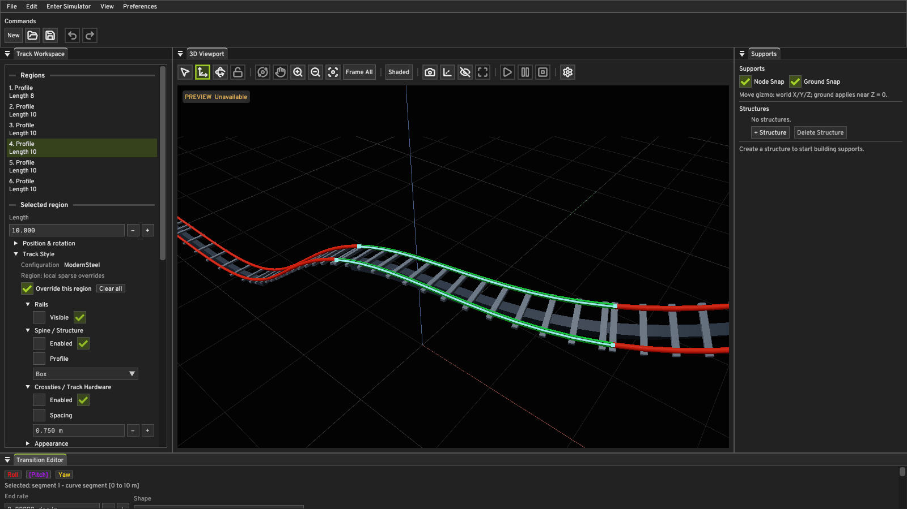
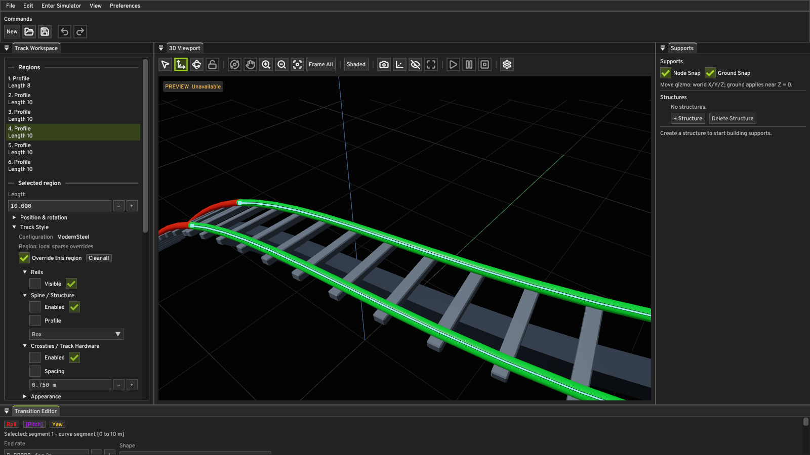
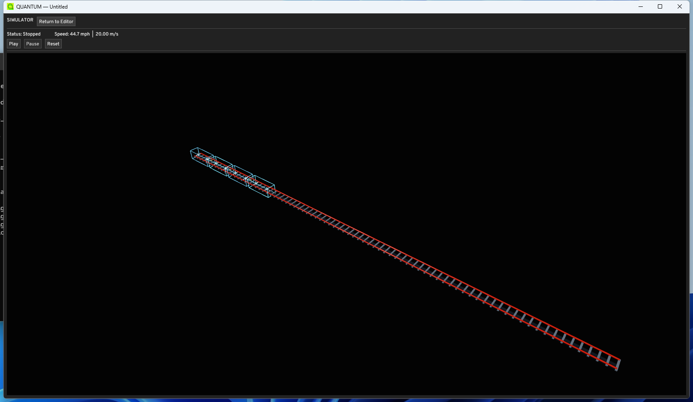

# Rendering M1: viewport multisampling

## Audit before the change

Rendering M0 used one sample for the offscreen R8G8B8A8 sRGB color image,
D32 depth image, and all five dynamic-rendering viewport pipelines. Dear ImGui
sampled that color image. The PBR fragment shader normalized interpolated
world-space normals and evaluated GGX specular per fragment. The straight and
curved rail sweeps used the same generated vertex normals: analytic ellipse
normals transformed by each centerline frame. ModernSteel rails have 16 radial
segments, and the configurable tubular spine defaults to 12. Box spine faces
have separate normals to retain hard corners. GLB loading requires and keeps
artist-authored NORMAL attributes, normalizing each imported vector.

The generated normals were continuous around tubes and along the sampled
centerline. The close capture showed hard stair steps at rail, crosstie, and
grid silhouettes rather than a flipped-normal or section seam defect. The
finite profile polygons still limit silhouette roundness when magnified. M1
does not alter centerline sampling, tessellation, materials, or PBR math.

## Implementation

The selected Vulkan device is queried for both framebuffer and image-format
color/depth sample support. A common 4-sample count enables MSAA; otherwise
the viewport uses the existing 1-sample path. The editor defaults to 4x when
supported, with a **4x MSAA** checkbox in Viewport Settings. On a change, all
in-flight viewport work completes before ImGui retires its descriptor,
attachments are destroyed, and the five viewport pipelines are recreated for
the new sample count. The swapchain and ImGui render pass remain 1x.

At 4x, a VMA-owned multisampled color attachment and a matching multisampled
depth attachment receive the 3D draws. Dynamic rendering resolves color into
the existing single-sample image that ImGui reads. The multisampled color
contents are discarded after resolve. Resizing follows the same descriptor
retirement and destruction order. The single-sample path renders directly to
the ImGui image.

## Actual Windows captures

All four images are 1600 × 900 Windows application readbacks using the same
ModernSteel document, selected region, camera orientation, lighting, and
viewport dimensions. The close pair uses the capture camera's 0.4 zoom factor.
The green region highlight, PBR rail highlight, box spine, and imported GLB
crossties are present in both modes.

| Framing | Off | 4x MSAA |
| --- | --- | --- |
| Selected region |  |  |
| Close rail and hardware |  |  |

The live Windows application also completed Editor → Simulator → Play → Return
to Editor. The Simulator viewport displayed the track and train wireframe
while stopped and playing; the Editor viewport returned with its grid and
reference geometry intact.

The 4x captures show smoother rail, crosstie, and grid silhouettes. The
surface highlight remains visible, and box edges stay sharp. MSAA reduces
coverage aliasing, but cannot eliminate subpixel shimmer from moving thin
geometry or per-fragment specular aliasing. Temporal AA remains a separate
option to evaluate if motion inspection shows an unacceptable remainder.

## Verification and performance

The Windows Debug and Release configurations both built completely. The full
Debug CTest suite passed 78/78 enabled tests; one pre-existing GPU residency
test is disabled. Six focused capture, viewport, asset, style, preview, and
diagnostic tests passed again in both configurations after the final edits.
Debug application captures ran with Vulkan validation; no validation error was
reported. A four-second Debug camera-orbit and window-resize smoke run passed
with GPU validation enabled and two viewport target resizes. Six-second Release
playback smoke runs passed at 1x (1,218 fixed steps) and 4x (1,202 fixed steps),
without preview or physics failures. The Editor and Simulator draw paths use
the same viewport image and attachment recreation code.

For the controlled rendering comparison, four Release runs alternated 1x and
4x. Each used the same ModernSteel document, 1600 × 900 window, camera-orbit
path, eight-second duration, and disabled OBS capture layer. The stopped
preview avoided physics as a variable. Values come from the existing preview
smoke telemetry; frame distribution is represented by p95 and p99.

| Run | Avg FPS | 1% low FPS | p95 / p99 frame ms | Avg GPU ms |
| --- | ---: | ---: | ---: | ---: |
| 1x, first | 4.284 | 1.282 | 268.804 / 780.220 | 0.556 |
| 4x, first | 4.187 | 1.266 | 267.427 / 789.973 | 0.486 |
| 1x, second | 4.256 | 1.263 | 268.706 / 791.754 | 0.590 |
| 4x, second | 4.351 | 1.279 | 266.492 / 782.070 | 0.569 |

Only 33–35 frames were captured per run, so the 1% low is effectively each
run's worst frame. These numbers do **not** demonstrate a 60 FPS target or a
reliable GPU-cost advantage for either sample count. The spike telemetry
attributes the large frame times to roughly 250 ms frame-slot fence waits in
both modes, while measured GPU execution averages below 0.6 ms. The stall is
present with MSAA off and matches the previously documented FIFO/fence pacing
issue. MSAA did not cause a measurable additional pacing regression in this
session; the fence bottleneck needs its own investigation before making any
60 FPS claim.
