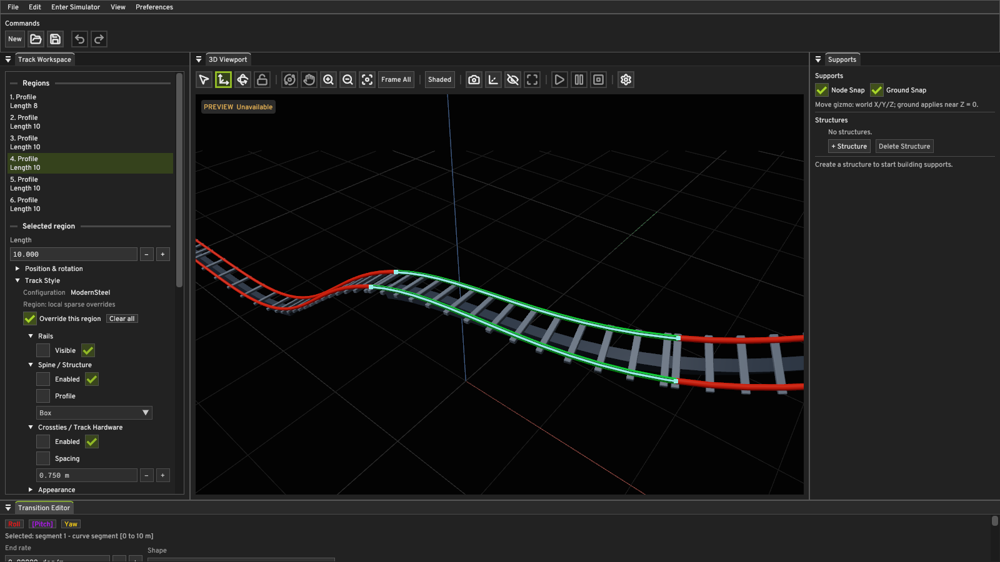
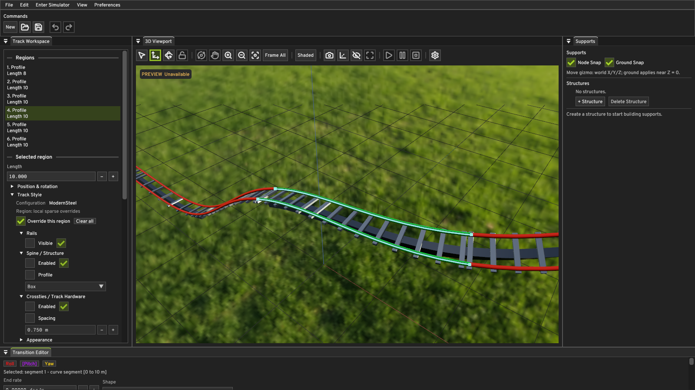
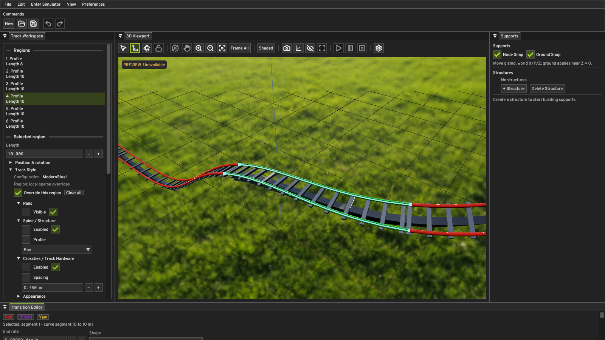
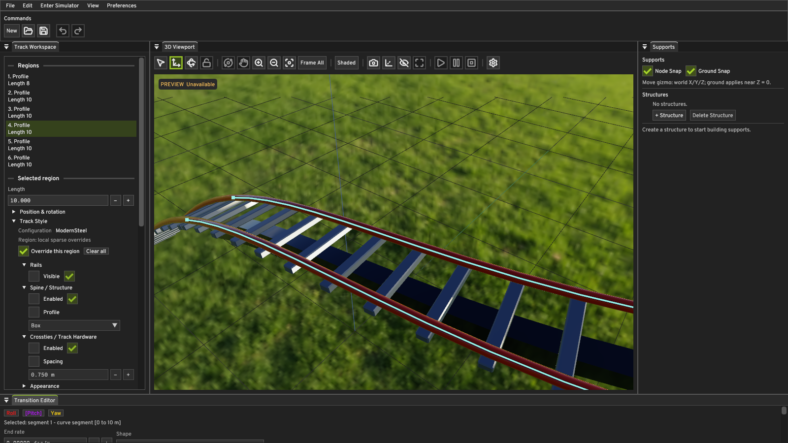
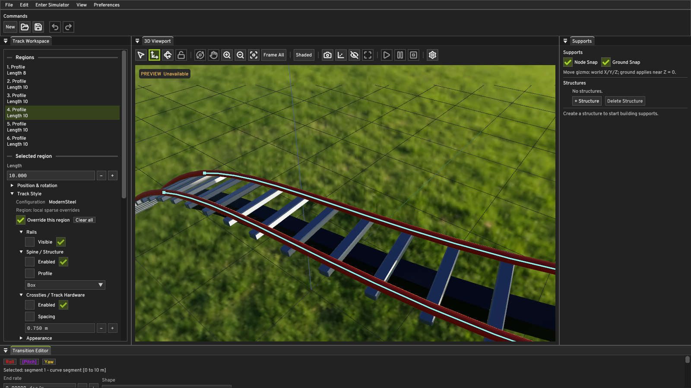

# Rendering M2 — HDR environment and image-based lighting

## Renderer boundary

The existing `Renderer` contract gains one coarse environment control call and
an availability capability. `EditorUi` owns the selected environment, rotation,
lighting intensity, and sky visibility in Viewport Settings. `VulkanContext`
still owns the sole renderer, its descriptor set, sampler, four sampled images,
one-time upload commands, sky pipeline, and synchronization. Editor and
Simulator use the same viewport draw path. No Vulkan handle enters the new RHI
control API.

The bundled test image is [Rooitou Park by Greg Zaal](https://polyhaven.com/a/rooitou_park),
distributed by Poly Haven under [CC0](https://polyhaven.com/license). The
shipped 1K Radiance HDR file is
`assets/environment/rooitou_park_1k.hdr` (SHA-256
`AF15CB5CA49DE469E2EE74FCB6622CB32B36E3F9EE95504FC762D9C3D62C5163`).
The editor build stages it beside the executable and installation includes it.

## HDR and filtering pipeline

At renderer initialization, the backend decodes the Radiance RGBE RLE scanlines
into linear floating-point RGB. It accepts the asset's `-Y +X` equirectangular
orientation, rejects malformed runs, and does not apply sRGB conversion to HDR
values. One-time CPU preprocessing samples the panorama into a 256-pixel sky
cubemap, a 24-pixel cosine-weighted diffuse irradiance cubemap, a 128-pixel
GGX-prefiltered specular cubemap with six roughness levels, and a 128-pixel
split-sum BRDF integration LUT. The Vulkan backend uploads these as sampled
RGBA32F images through VMA staging buffers, transitions them to shader-read
layout, and releases staging memory after the graphics queue becomes idle.
They are not regenerated while rendering frames or when the environment rotates.

The track shader keeps its existing GGX directional sunlight. For IBL it
samples diffuse irradiance along the normal and the prefiltered specular map
along the reflection direction, then combines that reflection with the BRDF
LUT and the material's metallic and roughness factors. The old constant ambient
term is used only when environment lighting is off or the asset is unavailable;
it is not added to IBL. Both paths still use the existing exposure and fitted
ACES tone map before writing to the sRGB viewport attachment. Environment
lighting intensity scales the ambient IBL term, while sky presentation uses
exposure alone. Zero lighting intensity removes the IBL term without restoring
the old constant ambient term. Sky visibility does not disable IBL.

The sky is a fullscreen triangle drawn before track geometry with depth test
and depth write disabled. The inverse view-projection matrix reconstructs a ray
from near and far positions; their difference cancels camera translation, so
the image follows orientation in both perspective and orthographic views.
The same world-Z rotation is used for sky, irradiance, and reflections. Track
depth still wins over the sky. The sky pipeline is rebuilt with the other
viewport pipelines when switching between 1× and 4× MSAA.

If the file cannot be decoded or is absent, the backend logs the reason,
uploads small valid fallback descriptors, reports the environment unavailable,
and retains M0's constant ambient illumination. Viewport Settings shows that
status. The Environment selector offers **None** and the bundled Rooitou Park
map. The renderer's selection and intensity change through push constants, so
they do not retire or recreate GPU images during frame rendering.

## Actual Windows application captures

The captures use the same 1600×900 ModernSteel document and deterministic
camera. **Off** is byte-identical to the prior Rendering M1 4× screenshot
(SHA-256 `826AA63869E2D3B67E727EAE7A739559C069D24E4C739AE8A3F3B6469FCA29DD`).
Thus the disabled path preserves prior output. The enabled and 90° rotated
frames show environmental changes on the track and in the background.

| Environment off | Environment on | Environment rotated 90° |
| --- | --- | --- |
|  |  |  |

The [close application capture](rendering-m2/close/modern-steel.png) shows the
painted rails, metallic box spine, and painted hardware under the HDR ambient
term. For a roughness check, two temporary copies of the same authored document
used red dielectric rails and metallic-0.8 spines, with both surfaces at
roughness 0.12 or 0.72. These captures used environment intensity 1 and sun
intensity 0 to isolate IBL. The glossy rail has a narrow bright reflection;
the rougher rail has a subdued, broader response. The metallic spine and
painted hardware remain illuminated without direct sunlight.

The [1× MSAA capture](rendering-m2/1x/modern-steel.png) uses the same HDR
environment through the single-sample viewport path. In the
[sky-hidden capture](rendering-m2/sky-hidden/modern-steel.png), the background
returns to black while the rails and hardware remain environment-lit. This
checks that sky visibility and IBL are independent controls.

| Roughness 0.12 | Roughness 0.72 |
| --- | --- |
|  |  |

The committed capture manifests reproduce off/on/rotated/close, 1×, and
sky-hidden views. The
temporary material comparison documents were derived from
`smoke-tests/modern-steel-validation.quantum` by replacing section 3's green
rail material with the red preset material, setting rail metallic factor 0,
spine metallic factor 0.8, and setting both roughness factors to the value
shown above.

## Validation and performance

The full MSVC Debug and Release builds passed. Both full CTest suites passed
all 78 enabled tests; `QuantumEngine.GpuTrainPoseResidency` remains disabled.
The full Debug suite preceded the final capture-harness option, so its two
affected tests (`PreviewSmoke` and `ReadmeCapture`) were rebuilt and rerun in
both configurations. All displayed captures came from the Debug Windows
application with Vulkan validation active and no reported validation error.
The Release mode-cycle smoke runs completed all eight queued actions in both
4× and 1× MSAA, returning to Editor after Simulator playback. They rendered
590 and 600 frames respectively over six seconds, each with 215 fixed steps
and no preview or physics failure. With the HDR file temporarily absent, the
Debug app logged the fallback, rendered 199 frames over two seconds without
failure, and the file was restored.
An additional Debug capture with HDR selected, environment intensity zero,
sun intensity zero, and the sky hidden showed no ambient fill on the shaded
track; editor selection edges remained visible.

Performance uses the existing Release preview-smoke collector with the same
ModernSteel document, 1600×900 window, stopped preview, camera orbit, and
eight-second duration for each environment condition, with OBS capture
disabled. The collector's GPU timestamps, average FPS, 1% low, frame-time
percentiles, and threshold counts are reported below. The rows are separate
serial runs; the initial HDR preprocessing precedes the measured interval.

| Mode | IBL | Frames | Average FPS | 1% low FPS | Average / p95 / p99 frame ms | Frames >16.667 / >33.333 ms | GPU ms |
| --- | --- | ---: | ---: | ---: | ---: | ---: | ---: |
| 1× MSAA | Off | 799 | 99.78 | 46.43 | 10.02 / 10.47 / 13.97 | 2 / 1 | 0.29 |
| 1× MSAA | On | 789 | 98.59 | 37.02 | 10.14 / 10.40 / 17.31 | 8 / 1 | 0.24 |
| 4× MSAA | Off | 800 | 99.96 | 50.38 | 10.00 / 11.14 / 13.13 | 1 / 1 | 0.29 |
| 4× MSAA | On | 794 | 99.15 | 40.63 | 10.09 / 10.32 / 17.08 | 8 / 1 | 0.21 |

The raw collector reports are saved under
[`rendering-m2/performance`](rendering-m2/performance), including the four
primary runs and both repeat pairs. They retain the full frame-time summaries,
GPU timestamps, and recorded spikes for review.

Two more serial 4× pairs reached 99.98/99.83 and 99.96/99.94 average FPS
for off/on. Their 1% lows were 52.25/46.49 and 50.73/46.77 FPS. GPU
execution averages across all three 4× pairs ranged 0.29–0.34 ms off and
0.21–0.32 ms on. The GPU ranges overlap; these short runs cannot isolate a
stable IBL GPU cost. The lower 1% lows with IBL in all three 4× pairs are a
tail-latency observation, not evidence of a known GPU bottleneck.

An initial matrix with frame tracing encountered the existing intermittent
FIFO frame-slot stall in all four conditions: only 34 frames per eight-second
run, about 4.2 average FPS, about 234–238 ms average fence wait, and
0.56–0.69 ms average GPU execution. A subsequent traced 4× off repeat ran at
98.91 FPS with 8.90 ms average fence wait. The stall did not reproduce with
or without frame tracing during the primary measurements. Its cause remains
unresolved, so the stalled matrix is excluded from the comparison above.

## Remaining limits

This milestone ships one selectable HDR image and a Radiance RLE decoder for
its supported orientation. The environment is distant and has no parallax;
local reflection probes, material texture maps, and directional shadows are
outside this milestone. The authored directional sun is independent of the
sun photographed in the HDR image, so their directions can differ. Skybox
ground content is likewise infinitely distant. The 1K source and finite
prefilter samples limit sharp reflection detail and can retain some bright
source aliasing. Startup preprocessing is one-time per application launch;
there is no persistent disk cache yet.
