# Supports M2A — Solid Timber Rendering

Supports M2A renders authored support graphs as solid, physically based timber
members. The initial renderer-only implementation is now accompanied by the
completed Hybrid accuracy, local bracing, mounting and outer-support work.
Hybrid M2A is frozen: integration cleanup adds no new framing or visual features.
The generator owns logical topology and member intent; Core resolves physical
placement before editor presentation and renderer upload.
See [final integration validation](hybrid-m2a-final-validation.md) for the complete
Debug/Release matrix, runtime smoke, capture review and cleanup inventory.

> **This is visual structural representation, not structural engineering.**
> Nothing here performs load analysis, stress or buckling checks, code
> compliance, footing design, or automatic timber sizing. Footing pads are a
> presentation proportion chosen so a footing reads as a footing, nothing more.

## Generator accuracy corrections (2026-09-30)

This section supersedes the original renderer-only M2A and M1 descriptions.
The current implementation retains
explicit `SupportMemberRole`, `SupportMemberOrientation` and optional
`orientationReference`; the existing solid-frame resolver consumes the reference.

Shared interior framing rows now use foundation elevation plus integer multiples
of `storyHeight`, below the lowest upper endpoint. A sorted two-pointer merge
matches equal actual elevations within 1e-6 Core units, advancing both rows after
a match. Foundation rows correspond separately; terminal caps correspond once.
In the simple archetype, unmatched ledgers terminate at their own bent. The last common row and the two
terminal caps bound a stepped upper transition bay. Selected longitudinal braces
use those same matched boundaries, so no row is rounded onto multiple other rows.
Modern's existing low-run two-tier rule remains pending its separate review;
its added half-height row corresponds only when actual elevations match.

Hybrid keeps an upright two-post core per framed unit; optional outer primary
lines supplement it. Lower rows are horizontal, centered over
the footing row with upright posts beneath an unbanked
horizontal shoulder. The shoulder sits below the lowest track attachment by
`0.25 * min(storyHeight, minimumAttachmentHeightAboveFoundation)`. Only the upper
post connections and cap reach the rider-frame attachment row. The clearance,
raised quarter-first-story ledger, section proportions, repeated tower-face
diagonals and simple-archetype every-third-bay brace selection remain procedural approximations;
none establishes manufacturer hardware dimensions or structural adequacy.

Hybrid post references use the actual bounding row vectors. Caps, ledgers and
ties use the actual supporting post at the member's start. Transverse brace
references are normals to the triangle formed by the brace and its lower row;
longitudinal brace references use the brace and the post-side segment between
matched panel boundaries. Each reference is projected off its own member axis
and normalized without a sign flip. Nonplanar panels deliberately use that local
triangle, not a fictitious whole-bent or averaged bay plane. References stay
authored on endpoint edits; regeneration recomputes them. Already-unit references
are stable across save/load normalization.

In SimpleBent, both shoulder and attachment-row Hybrid longitudinal connections are
`LongitudinalTie`. This generator does not demonstrate a track stringer function,
so it emits no Hybrid `TrackSupport` members. The role remains supported for
authored members and existing documents. Mounting shifts physical endpoints as
described below; detailed joint cuts, steel track-interface hardware and
cantilevers are not modeled. Unmatched story
termination and the upper connection geometry remain conservative procedural
representations, not engineered transition details.

All four generators now assign roles and role-specific sections. The shared
elevation/correspondence correction also applies to all families. Traditional,
Modern Twister and Prefabricated retain their existing family organization and
Generic orientation fallback; their dedicated accuracy review remains pending.

### Hybrid connected-tower topology (direct-reference correction)

The user-supplied orthographic and perspective references show repeated paired
post frames, open connecting bays and staggered local horizontal connections.
They establish a framing language, not measured RMC dimensions or a universal
number of transverse post lanes.

`WoodenSupportRunRecipe::hybridArchetype` now supports `SimpleBent`,
`ConnectedTowers` and `Automatic`. Explicit choices persist as an optional recipe
field. Missing fields load as Automatic; saved member geometry is not regenerated
on load. There is no new UI. Automatic selects ConnectedTowers for the whole run
if any sampled tower needs more than one lower-frame story; otherwise it selects
SimpleBent. This isolated QUANTUM heuristic is replaceable by authored regions,
graph decisions or local geometry rules. It is not an authentic height threshold.

SimpleBent preserves the existing two-post organization, raised ledger and
actual-elevation story correspondence. It can also be selected for tall runs.
ConnectedTowers assembles neighboring two-post towers within one structure.
Each tower retains its own transverse rows, cap, story count and face diagonals.
Actual interior story elevations still use foundation elevation plus multiples
of storyHeight; varying tower heights terminate these rows independently.
Arbitrary per-tower story origins are not implemented.

For connected towers, each neighboring bay derives horizontal tie elevations
from the preceding tower's interior story rows. Terminal caps stay local, avoiding
an additional near-cap tie beside a short terminal story. Alternating bays offset those
elevations downward by 0.35 storyHeight. The unshifted bays also connect at a
raised lower-ledger height available within both posts. Shifted bays omit that
baseline connection. Elevations outside the receiving lower post's height are
omitted, never rounded or fanned onto another row. Each accepted tie uses equal
physical endpoint elevations. The offset and bay schedule are visual procedural
approximations of the orthographic pattern.

A tie can meet a post between transverse rows. Its generated node splits the
incident PrimaryPost into two collinear members; existing equal-height nodes are
reused, including points from the other neighboring bay. No transverse ledger
is created for these intersections. The new post segments retain their profile
and BentPost reference; LongitudinalTie members use the Hybrid tie profile and
derive their RunLongitudinal reference from the actual incident post. Junctions
are ordinary document geometry and survive serialization and Undo/Redo.

Both archetypes now use upright lower posts (base spread equals upper width),
without mandatory 1.5 base splay. Upper post links alone reach banked attachments.
Selected tower faces repeat single diagonals in one direction through their
stories. This is a local procedural choice, not a universal prohibition on other
brace patterns. ConnectedTowers leaves all connecting bays free of longitudinal
diagonals by default, including when longitudinalBracing is true. Explicit
local panel choices can add a single run diagonal; SimpleBent retains its
optional every-third-bay approximation. Upper attachment ties retain their own
geometry and may slope; they are distinct from the horizontal lower connections.

Focused Debug verification covers both archetypes, independent rising/falling
stories, intermediate post junctions, unchanged transverse ledgers, no duplicated
or fanned ties, upright posts, deterministic regeneration, profiles, actual
orientation references on curved/banked runs, persistence and exact Undo/Redo.
The three Windows editor acceptance captures are generated by
`hybrid-topology-captures.json` after exporting their documents with
`QuantumCoreHybridTimberAccuracyTests` and three output document paths.

- [Simple Hybrid](images/hybrid-topology/supports-hybrid.png)
- [Connected towers](images/hybrid-topology/supports-tall.png)
- [Staggered connection close-up](images/hybrid-topology/supports-closeup.png)

### Final local choices and outer supports

[Local bracing](hybrid-local-bracing.md) provides sparse ConnectedTowers
longitudinal Open/SingleDiagonal choices and transverse face/direction overrides.
Panels use actual local tie or story boundaries; absent selections stay dormant
when a recipe changes. There is no panel-selection UI or universal brace schedule.

[Outer supports](hybrid-outer-support.md) can add independently founded inclined
PrimaryPost chains on selected tower sides, around the unchanged upright inner
pair. Ledger extensions meet these chains at existing transverse elevations.
Explicit base/top outsets determine inclination; Automatic never selects outer
supports. These are primary framing lines, not role-inferred diagonal braces.

## Architecture

Newly generated Hybrid members now resolve physical face mounting before the
instance transform. Legacy members without mounting metadata retain centered
placement. See [Hybrid member mounting](hybrid-member-mounting.md) for the exact
optional member-end schema, frame signs, layering, overhang and verification.

```
AuthoredTrack (Core, logical support graph and persisted intent)
  └─ SupportCollection / SupportStructure / SupportMember / SupportNode
       ├─ role / orientation / orientationReference / end mounting
       ├─ generatedWoodenRun recipe and local Hybrid choices
       ├─ SupportAppearance            (tint, roughness, normal, scale)
       └─ SupportFoundationAppearance  (concrete color, pad size)

resolveSupportMemberPlacements()  Core, derived endpoints and member frames
  └─ editor picking, highlights and bounds use physical geometry
       (node handles and technical lines retain logical geometry)

buildSupportSolidPresentation()   Core, renderer-neutral
  └─ SupportSolidPresentation { appearance, batches[], foundations[] }
       └─ one SupportSolidBatch per profile shape
            └─ SupportMemberInstance { mat4 transform }

Renderer::updateSupportSolidPresentation()
  └─ VulkanContext
       ├─ one shared instance stream (contiguous, VMA host-visible)
       ├─ one shared unit box mesh + one shared unit cylinder mesh
       ├─ one timber descriptor set (albedo / normal / roughness)
       └─ one instanced draw call per (structure × profile shape)
```

The existing graph, transaction/history and renderer publication seams remain.
Generation and explicit regeneration author the current graph; loading never
regenerates saved geometry. The technical line stream retains logical endpoints.

### Why a new Core module

`SupportSolidGeometry.hpp` sits beside `Supports.hpp` in Core rather than in
the engine, because placement is derived from logical endpoints, profiles,
orientation evidence and incident-post mounting intent. That makes geometry testable
without a GPU, and it keeps the renderer responsible only for GPU resources —
the same split `TrackStyle.cpp` already uses for track and hardware geometry.

### Member semantics and compatibility

`SupportMemberRole` explicitly records Unspecified, PrimaryPost, LedgerCap,
LongitudinalTie, Brace or TrackSupport. Generation uses roles for section
selection; mounting uses PrimaryPost hosts and ledger/tie envelopes. Roles are
never inferred from angle. Hybrid generates upper ties rather than claiming a
demonstrated TrackSupport/stringer function. Legacy/manual members default to
Unspecified, and that field is omitted when saved.

`SupportMemberOrientation` names Generic, BentPost, BentTransverse,
RunLongitudinal, BentDiagonal or RunDiagonal. Hybrid assigns these contexts;
other generated families retain Generic. Optional `orientationReference`
stores directed, normalized cross-section evidence in document coordinates.
Endpoint edits preserve it; regeneration re-authors it from geometry. The
renderer still groups by profile shape, without role-specific GPU batches.

End connections optionally persist mounting intent independently of connector
`localPlacement`. Missing mounting preserves centered physical endpoints.
Derived frames, offsets and instance matrices are never document state. The
existing equality, serialization and whole-document history cover all intent.

## Unit-mesh and instance strategy

The renderer uploads **two immutable unit meshes**, once, at startup:

| Mesh | Extent | Used for |
| --- | --- | --- |
| Unit box | `[-0.5, 0.5]`³ | rectangular timber, foundation pads |
| Unit cylinder | `x ∈ [-0.5, 0.5]`, radius 0.5 | circular timber (16 radial segments) |

A member's instance transform's basis columns are `axis × extent`, so the
transform carries length, cross-section, and orientation together. The vertex
shader recovers the member's object-space size from the column lengths, which
means **no per-member CPU mesh is ever built** and the instance payload stays a
single `mat4`.

- Rectangular members of one structure: **one** `vkCmdDrawIndexed`.
- Circular members of one structure: **one** more.
- Foundation pads: **one** more, reusing the box mesh.
- A whole generated family (rectangular only, as M1 produces): **one** draw call.

Instances from every structure live in one contiguous host-visible VMA buffer.
A draw batch selects a mesh plus an instance range; no batch owns buffers.

## Member transform strategy

`memberTransform()` places the unit box between resolved physical endpoints:

```
transform[0] = axisX * length
transform[1] = axisY * width
transform[2] = axisZ * depth
transform[3] = midpoint(start, end)
```

The box spans exactly `[start, end]`. Without mounting these are logical node
positions. Hybrid face contacts, layer clearances, support coverage and overhang
are resolved first, so physical endpoints can differ from logical nodes.
Square-ended solids still approximate joints and can intersect at corners.

The basis is orthonormal apart from its per-axis extents, so the vertex shader
removes those extents to get a pure rotation. That keeps normals correct for a
post whose length is far larger than its cross-section, which an inverse-
transpose alone would not.

### Rectangular orientation rule

1. Local **+X** is the resolved start-to-end axis, normalized.
2. Local **+Y** is the authored reference projected off +X and normalized,
   preserving its sign; local **+Z** completes the right-handed basis.
3. An absent or axis-parallel reference uses the orientation enum fallback.
   BentPost prefers world +X; other authored contexts prefer world +Z and can
   try the alternate reference if their projection degenerates.
4. Generic without a reference retains the historical world +Z rule, switching
   to world +X when `abs(axisX.z) > supportMemberVerticalTolerance` (0.9995).

That Generic threshold is not globally continuous. Hybrid references and the
BentPost fallback avoid relying on that angle branch for authored post roll.
Nonplanar panels use member-local geometric triangles rather than an averaged
plane. `resolveSupportMemberFrame()` is shared by placement and presentation.

### Profile interpretation

| Shape | Width | Depth | Length |
| --- | --- | --- | --- |
| Rectangular | `outerDimensions.x` | `outerDimensions.y` | resolved endpoint distance |
| Circular | `outerDimensions.x` (diameter) | same | resolved endpoint distance |

`validateSupportMemberProfile` already requires a circular profile to have
equal outer dimensions, so the diameter applies to both cross-section axes.

`wallThickness` is a M2B hollow-section concern and is **not** applied in M2A;
the unit meshes are solid and only the outer envelope is rendered.

Degenerate members (length at or below `minimumSupportMemberLength`, matching
the M1 generator's own guard) are **skipped** rather than rendered. The
generator already rejects them, so reaching one means externally written or
hand-edited data; skipping keeps a NaN basis out of the instance buffer
without failing the whole presentation.

## Timber texture set

The M2A material samples three maps, all from the user-authored pine set at
`assets/materials/timber/pine/`:

| Map | Encoding | sRGB upload | Used |
| --- | --- | --- | --- |
| `pinewood_basecolor_neutral.png` | neutral grayscale albedo | yes | yes |
| `pinewood_normal.png` | tangent-space normal | no | yes |
| `pinewood_roughness.png` | roughness detail | no | yes |
| `pinewood_ao.png` | ambient occlusion | — | **no** |
| `pinewood_height.png` | height source | — | **no** |
| `pinewood_edge.png` | edge source | — | **no** |

The files on disk are named `pinewood_height.png` and `pinewood_edge.png`
rather than the `_source` names in the brief. They are user files and are not
renamed; they are unused either way.

### Neutral, tintable base color

`pinewood_basecolor_neutral.png` is **fully grayscale** — verified: every
sampled texel has R = G = B, mean 176/255. A regression test asserts this, so
a future asset that bakes a hue into the map fails CI rather than silently
making the tint non-authoritative.

The shader therefore computes:

```glsl
vec3 base = srgbToLinear(draw.baseColor.rgb) * texture(albedoMap, surfaceUv).rgb;
```

final base color = authored sRGB tint × neutral wood detail

The tint is a document value applied in the shader, so it is non-destructive,
participates in Undo/Redo, survives save/load, and never modifies the PNG. The
tint is **independent of `TimberSupportFamily`**: Hybrid Timber Lattice does
not imply brown, and Modern Twister Timber does not imply tan. Geometry and
appearance are separate concepts, and the documentation screenshots show the
same Hybrid structure in two different tints to make that concrete.

Default tint is a conservative natural pine, `sRGB(0.78, 0.64, 0.47)`.

### Normal-map convention — verified, not assumed

Materialize/GIMP can export either OpenGL (+Y up) or DirectX (+Y down) normal
maps, and getting this wrong inverts every bump. Rather than assume, the
convention was measured from the authored data: correlating the map's green
channel against the numerical vertical gradient of its own height source
gives

```
corr(G − 128, dh/dv) = −0.415   over 47,816 samples
```

Negative means green increases as height decreases — the **OpenGL / +Y-up**
convention. That is the same handedness `ground.frag` already assumed for its
world-aligned basis, so the sample maps directly onto +B with **no inversion**.
A DirectX-encoded map would require negating `normalSample.y`. The result is
recorded in the shader comment.

### Roughness — why the map is remapped

QUANTUM's `ground.frag` treats a roughness map as a **straight multiplier** on
the authored scalar. The supplied pine map cannot be used that way:

- its median is ≈ 0.31 (measured), and
- ≈ 13% of texels are near-black.

A straight multiply drives those texels to near-mirror roughness, which reads
as wet, varnished wood rather than untreated timber. M2A therefore treats the
map as a **detail signal remapped into a band around 1.0** and multiplied by
the authored roughness:

```glsl
float detailBand = mix(0.55, 1.45, roughnessMap.r);
float roughness  = clamp(0.85 * authoredMultiplier * detailBand, 0.045, 1.0);
```

This keeps the grain-correlated variation that makes the surface read as
timber, keeps the material matte, and keeps the authored Roughness Multiplier
control meaningful. Metallic is a hard zero — untreated timber is a dielectric
with F0 = 0.04.

## Physical texture scale

§11 of the brief calls out the failure mode where one copy of the wood texture
is stretched from one endpoint of a member to the other, producing enormous
knots and meter-wide grain. M2A avoids it structurally rather than by tuning:

- The unit mesh has **no UV attribute at all**.
- The vertex shader computes the member's object-space position in **Core
  units** (`inPosition * extent`, where `extent` is recovered from the instance
  transform), then derives UVs from that.
- UVs are divided by the authored `textureScale`, which is expressed in Core
  units per repeat.

So a 12-unit post and a 1-unit brace show the **same grain size**; the long
member simply contains more repeats. Default `textureScale = 1.0` Core unit per
repeat, adjustable from 0.1 to 8.0 in the Support Appearance panel.

## Wood grain direction

Grain runs along the member's longitudinal axis. The shader projects per face:

- **Side faces** (normal on a cross-section axis): U from object **+X** (the
  length), V from whichever cross-section axis lies in the face.
- **End caps** (normal on ±X): projected across the cross-section instead,
  which reads as end grain without a dedicated end-grain texture.

Because the tangent basis is recovered per face from the instance transform,
this stays coherent on all six box faces and on the cylinder's side wall.
Exact end-grain texturing is not implemented, as §12 permits.

Known limitation: the side-wall projection is per-face rather than a single
projection across all faces, so the seam between two adjacent faces on the
same member shows a UV discontinuity. At authored scale this is not visible in
any of the documentation screenshots.

## Support appearance data model

Appearance lives on the **structure**, in two optional fields:

```cpp
struct SupportStructure {
    ...
    std::optional<SupportAppearance> appearance;
    std::optional<SupportFoundationAppearance> foundationAppearance;
};
```

They are optional so a document written before M2A loads unchanged and resolves
to the conservative default — the same pattern M1 used for
`generatedWoodenRun`. Persistence:

- Serialized only when authored, so an untouched M1 document keeps its byte
  layout.
- Textual and structural field names; no numeric codes.
- Partial blocks load deterministically: every scalar falls back to its default.
- `SupportStructure`'s defaulted `operator==` covers the new fields, so
  document equality — which is what Undo/Redo compares — works unchanged.
- Regeneration carries both fields forward, because regeneration replaces
  topology, not material.

Undo/Redo participates through the existing `AuthoredTrackEditTransaction` +
`DocumentHistory` path, including drag coalescing for continuous slider edits.

## Foundation rendering

Each `SupportNode` carrying a `Foundation` produces one concrete pad. The
existing node position stays authoritative.

- **Shape:** world-aligned box, centred on the foundation node.
- **Footprint:** `3.0 ×` the largest cross-section dimension of the members
  that node carries.
- **Thickness:** `1.5 ×` that same cross-section dimension.

Thickness deliberately comes from the **carried cross-section**, not from the
pad footprint. Scaling thickness by the footprint made a footing as thick as it
is wide, which rendered as a square pillar stub; that was caught in the
viewport and corrected.

Pads are centred rather than hung entirely below their node, because M1 places
foundation nodes exactly on the foundation elevation plane — a pad below its
node would be buried under the ground surface and never readable.

Presentation is neutral PBR-ish concrete: neutral grey tint, high roughness,
zero metallic. An authored `SupportFoundationAppearance` can override color,
roughness, and pad dimensions; a zero dimension means "derive from the carried
cross-section", which is the default.

No excavation, no terrain following, no footing sizing from loads.

## Debug lines and solid display

Two independent checkboxes in the Support Appearance panel:

| Solid | Lines | Use |
| --- | --- | --- |
| ON | OFF | presentation |
| ON | ON | technical inspection over solid timber |
| OFF | ON | legacy / debugging |

They are **viewport presentation, not document state**, so they deliberately
bypass the transaction and the Undo history. `VulkanContext::setSupportDisplay()`
gates the two draw blocks independently.

The line overlay's buffer and publication path are preserved. When solids are
also visible, its centerlines use a depth-free line pipeline so they remain
readable through the timber; lines-only mode retains the usual depth-tested
pipeline.

## Performance observations

Historical measurements from the initial renderer-only M2A implementation;
these are not a benchmark of the completed Hybrid topology or mounting resolver.

Measured in a successful four-second Release `--dev-preview-smoke
--support-performance --frame-trace` run at 1920×1080 with 4× MSAA.
The display flags change at frames 60, 160, and 280. Dense fixture:
273 members + 34 footings (307 solid instances).

| Display window | Frames | Renderer draw CPU (avg) | p95 |
| --- | --- | --- | --- |
| Solid timber only | 100 | 8.343 ms | 9.027 ms |
| Solid timber and lines | 120 | 8.351 ms | 9.120 ms |
| Lines only | 123 | 8.499 ms | 12.138 ms |

The playing-preview run averaged 100.46 FPS (9.954 ms/frame), with a
52.65 FPS one-percent low and two frames above 16.667 ms. The three draw-CPU
windows are close enough that this run does not isolate a reliable per-support
cost. Track, terrain, train, presentation, and frame pacing are all included.

Deliberately avoided:

- no per-timber CPU mesh,
- no per-timber draw call,
- no per-frame geometry recreation,
- no GPU resource churn on steady state.

Geometry is rebuilt and re-uploaded **only when support publication changes**
(every accepted support edit, document load, undo/redo, or regeneration) —
exactly the existing retained-upload pattern the track mesh and track hardware
already use.

I did **not** verify a tens-of-thousands-of-members structure; the dense
fixture above is 273 members, and §22's "thousands to tens of thousands"
regime is untested.

## Documentation screenshots

The images in this section are historical renderer-only acceptance captures.
Current Hybrid framing, mounting, local bracing and outer-support captures are
linked above; these older images remain useful for material, tint and
technical-display examples.

All images are real captures from the Windows Vulkan editor. The nine feature
views use the `--capture-screenshots` manifest in
`build/m2a-shots/codex-verify.json`; the two technical views use the same close-up
scenario with different display flags.

### Four structural families

| Family | Image |
| --- | --- |
| Traditional Timber Bent | 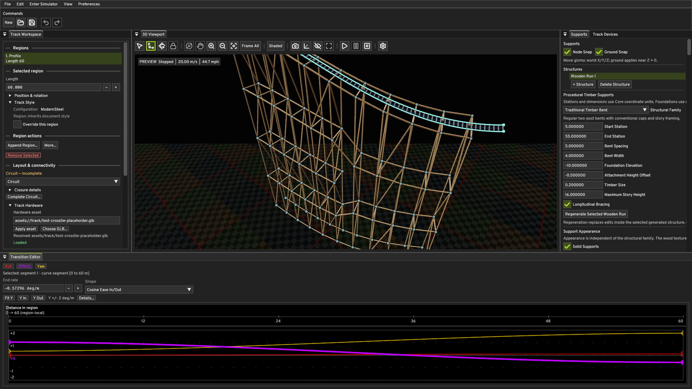 |
| Modern Twister Timber | 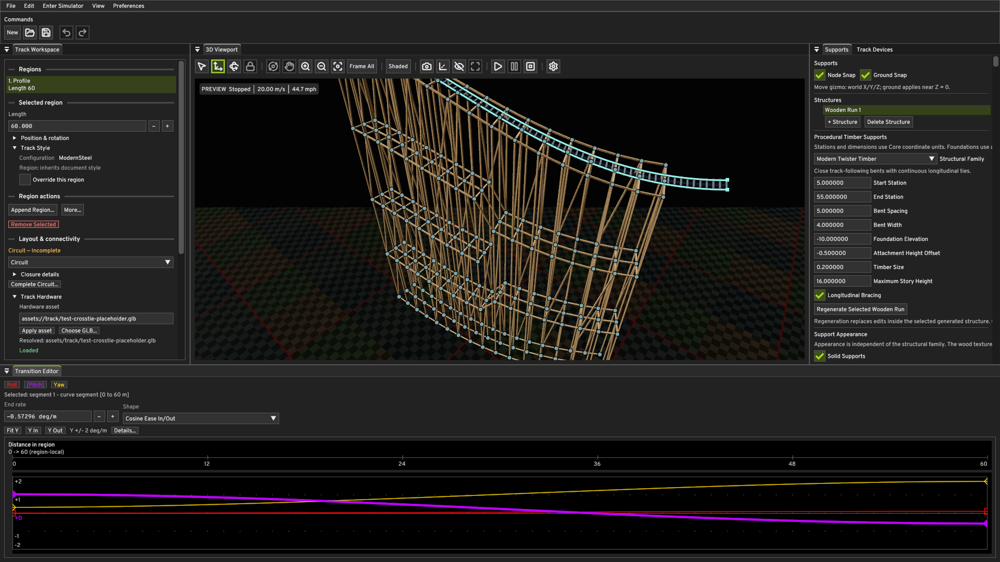 |
| Prefabricated Steel-Core Timber | 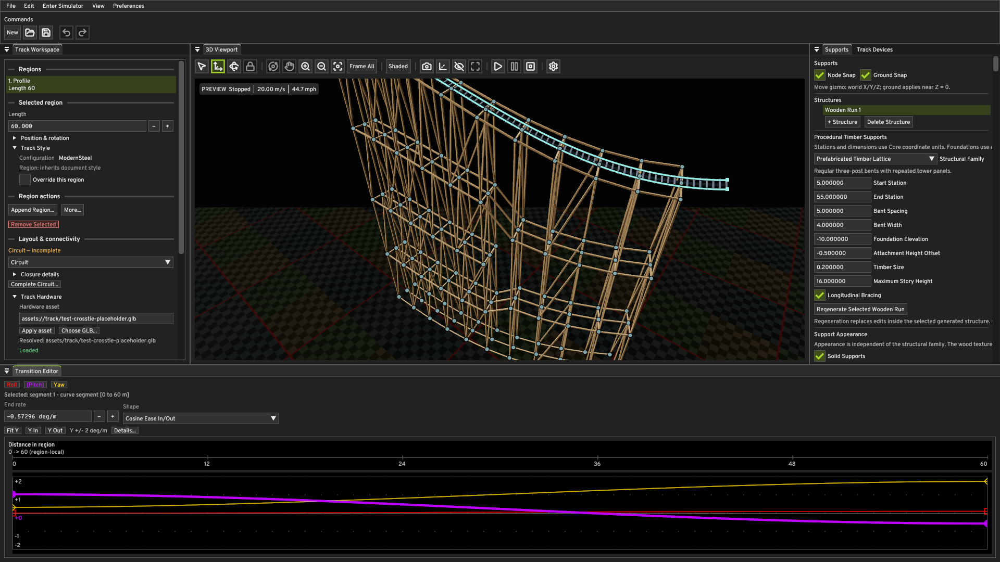 |
| Hybrid Timber Lattice | 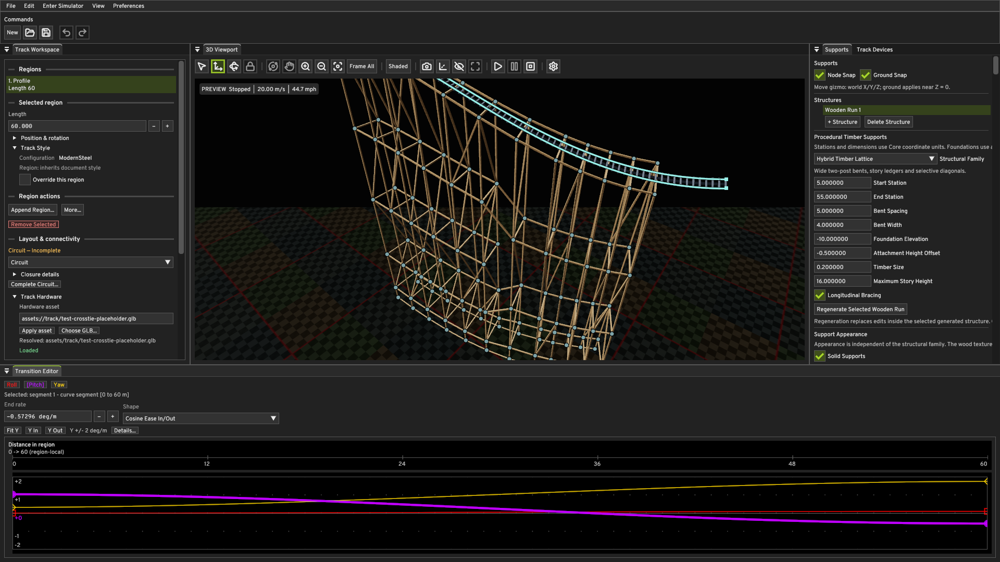 |

### Timber detail, height, and footings

| View | Image |
| --- | --- |
| Close-up (grain, miter-free joints, member cross-sections) | 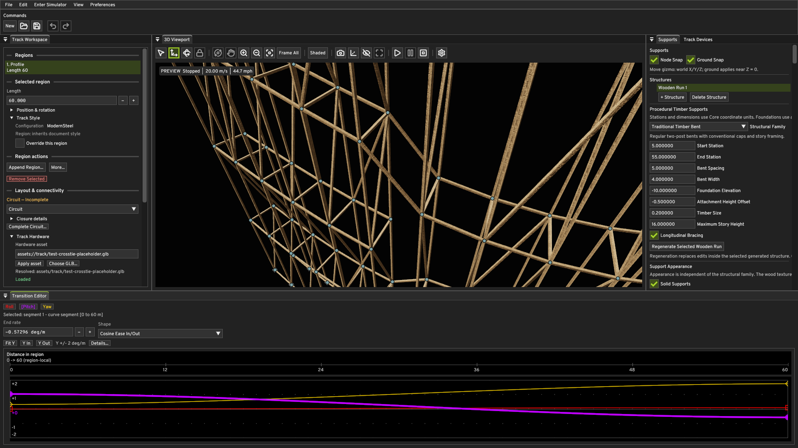 |
| Tall structure (story framing, no random roll) | 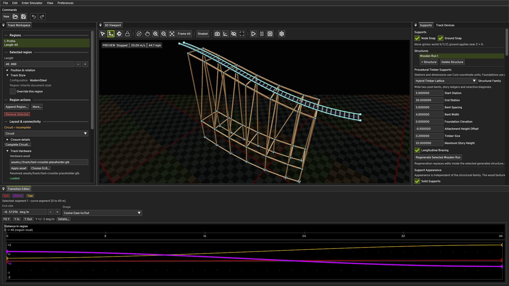 |
| Foundations (one concrete pad per foundation node) | 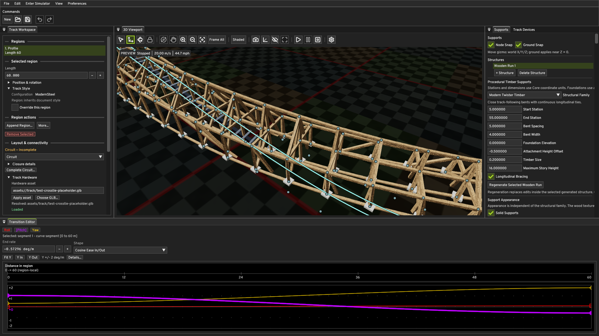 |

The foundation capture uses a lower track profile so the pads are large enough
to read; the capture camera frames the centerline plus support nodes, so a tall
coaster would show its footings only as a thin line at the frame edge.

### Technical overlay

| Display | Image |
| --- | --- |
| Solid timber and debug lines | 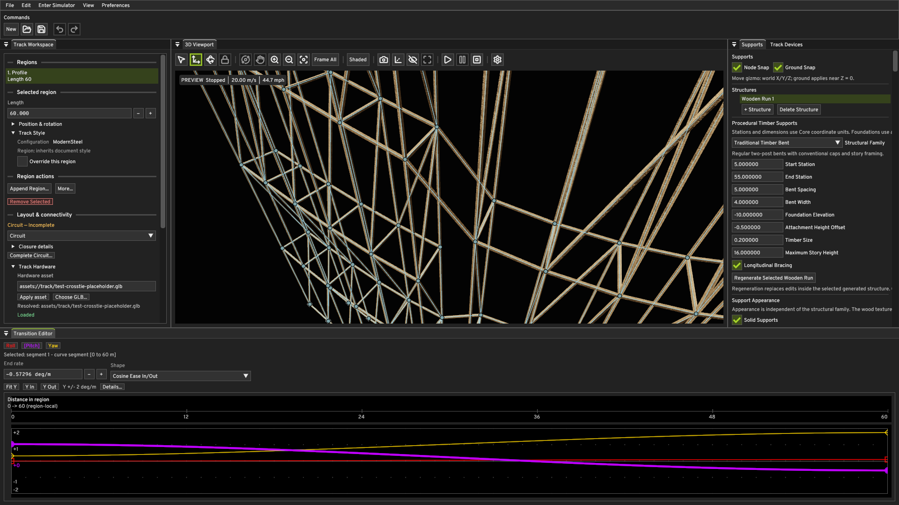 |
| Debug lines only | 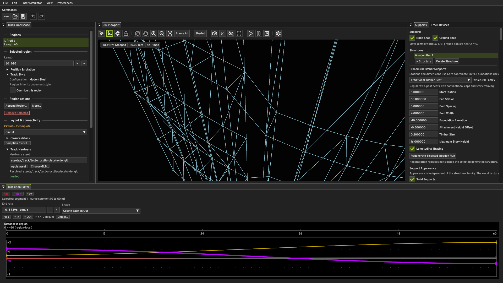 |

### Tint is independent of family

Same Hybrid Timber Lattice structure, same framing, two authored tints:

| Tint | Image |
| --- | --- |
| Natural pine `sRGB(0.78, 0.64, 0.47)` | 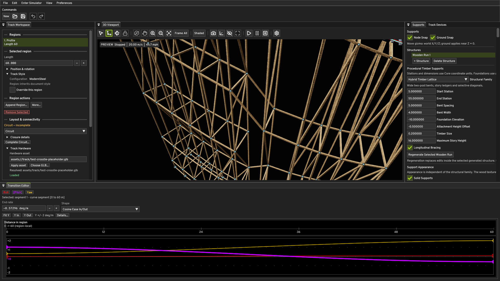 |
| Weathered gray `sRGB(0.50, 0.51, 0.50)` | 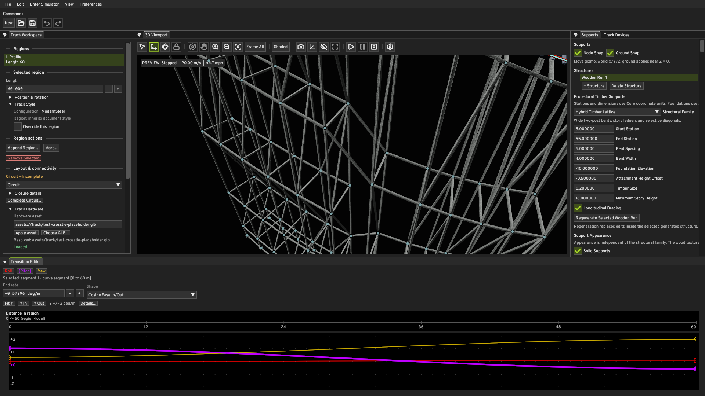 |

## Resource lifetime

Follows the project's existing rules rather than inventing a new scheme.

- **Unit meshes:** uploaded once, immutable, retained for the context's
  lifetime. An MSAA switch rebuilds the pipelines but keeps the meshes.
- **Timber textures:** uploaded once at startup into a dedicated descriptor
  set, published candidate-then-drain, never re-created.
- **Instance stream:** rebuilt only on support publication change, using the
  existing `createHostVisibleBuffer` + `reserveDeferredBufferRetirements` +
  `deferBufferRetirement` pattern, so a rejected publication leaves the
  currently displayed presentation untouched.
- **Failure cleanup:** `createSupportSolidResources()` is all-or-nothing and
  calls `destroySupportSolidResources()` on any throw; the texture upload
  releases only what it created.
- **Device limit:** the shared solid push-constant block is 144 bytes, above
  Vulkan's guaranteed 128-byte minimum, so pipeline creation reads
  `maxPushConstantsSize` and fails with a named reason rather than creating an
  invalid layout.
- **Shutdown order:** solid-support textures, meshes, and instance stream are
  released before `destroyEnvironmentResources()` (its pipeline layouts
  reference the environment descriptor layout) and before
  `vmaDestroyAllocator`, since they hold VMA allocations.
- **Document switching:** loading another document republishes through the same
  path; stale structures are not retained.

Verified by the verification pass: generate, regenerate, delete a structure,
open another document, and shutdown all complete without validation errors or
GPU leaks in the log.

## Known limitations

1. **No end grain.** End caps use a cross-section projection, not a dedicated
   end-grain treatment.
2. **UV seam between adjacent side faces** of the same member (§12 permits a
   shared projection limitation; not visible at authored scale).
3. **No AO.** `pinewood_ao.png` ships unused because QUANTUM's current PBR
   path has no AO input. Adding one purely for this milestone would mean
   redesigning the shared material system, which §15 forbids. No AO is baked
   into the base color.
4. **No height displacement or edge wear.** `pinewood_height.png` and
   `pinewood_edge.png` are reserved for future parallax, micro-displacement,
   weathering, and edge-wear work. Structural silhouettes stay clean.
5. **Hollow sections render as solid.** `wallThickness` is ignored; it is a
   M2B concern.
6. **Circular-member seams** are not hidden by UVs; a round post shows a
   longitudinal texture seam.
7. **Family-specific accuracy** beyond Hybrid remains pending its own milestone.
8. **No carpentry.** No mortise-and-tenon, lap joints, bolts, straps, plates,
   or saddles. Legacy centered members can overlap at shared nodes. Newly
   generated Hybrid members use semantic face mounting and layer separation;
   exact cut contact surfaces remain unmodeled.
9. **Footing pads are sub-pixel** when the camera frames a whole coaster. This
   is a framing consequence, not a rendering fault: the pads draw, and the
   foundation capture frames a low track so they read clearly.
10. **Scale not stress-tested** at tens of thousands of members (§22).
11. **Foundation pads are a presentation proportion**, not an engineering
    result.

## Out of scope for M2A

Terrain, terraforming, tiled world maps, Gaea/Blender import, ground layers,
biomes, sky replacement, dynamic sky, weather, structural load analysis, FEA,
automatic timber sizing, real-world joints, bolts, steel connector plates,
catwalks, stairs, handrails, maintenance platforms, steel support generators,
new support families, a PCG graph editor, scenery collision avoidance, and
station exclusion are all explicitly out of scope. No sky, sky shader, HDRI
loading, IBL filtering, irradiance generation, reflection environment, exposure,
or sky asset was modified — verified by inspecting the diff for
`engine/shaders/sky.*`, `EnvironmentMap.cpp`, `EnvironmentVulkan.cpp`, and
`EnvironmentAssets.cpp`, all of which are untouched.

## Tests

| Suite | Coverage |
| --- | --- |
| `QuantumCore.SupportSolidGeometry` | rectangular transform vs endpoints and profile, length, width/depth, vertical/horizontal/diagonal orientation, right-handedness, determinism, no random roll, continuity, degenerate skipping, circular profiles, draw-call count, foundations, default appearance, family independence, regeneration preserving appearance, save/load round trip, old-document defaults, validation rejection, all four M1 families, curved/banked stability |
| `QuantumEngine.SupportSolidRenderer` | unit box closedness, per-face winding, shared corners, unit cylinder sizing and tessellation, mesh determinism, timber identifier grammar, asset path resolution, bundled base color is grayscale |

The original renderer suites remain. The completed work also adds role,
HybridTimberAccuracy, orientation/reference/frame, mounting, local bracing and
outer-support suites. Generator expectations were updated for actual-elevation
correspondence and the completed Hybrid topology; this is no longer an unchanged
M1 topology test set.

## M1 topology impact

The initial renderer-only change preserved M1 topology and carried appearance
through regeneration. That historical scope was superseded by the completed
Hybrid corrections described above: upright lower frames, separate banked upper
attachments, connected-tower post junctions, local bracing and outer primary
lines. Shared roles, sections and actual-elevation correspondence also affect
new generation in the other families; their accuracy passes remain deferred.
Loading old documents preserves saved geometry. Explicit regeneration uses the
current recipe rules and preserves structure appearance and identity.
